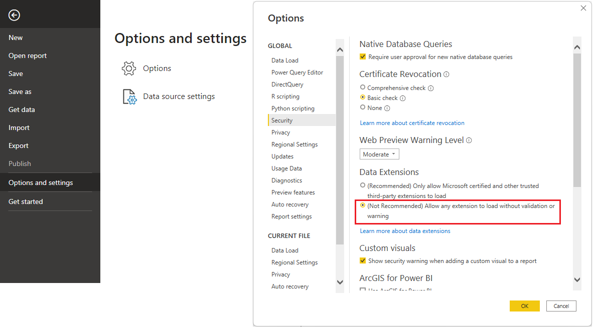

## Connector Download

The Power BI connector is available to download from the automated CI workflow: [link](https://github.com/opensearch-project/sql/actions/workflows/bi-connectors.yml).
The release snapshots are also available here: [OpenSearch Project](OpenSearchProject.mez) and [Amazon OpenSearch Service](AmazonOpenSearchService.mez).

## Connector Install

1. Put connector `mez` file into: `C:\Users\%USERNAME%\Documents\Power BI Desktop\Custom Connectors`.
2. Install OpenSearch `ODBC` [driver](../../sql-odbc/README.md).
3. Run `Power BI Desktop`.
4. Check under `File | Options and settings | Options | Security | Data Extensions` option `(Not Recommended) Allow any extension to load without validation or warning in Power BI Desktop`:

6. Restart `Power BI Desktop`.

## See also

* [Changelog](CHANGELOG.md)
* Installation instructions for
  * [OpenSearch Project connector](OpenSearchProject.md)
  * [Amazon OpenSearch Service connector](AmazonOpenSearchService.md)
* Connector user manual for
  * [Power BI Service](power_bi_service_support.md)
  * [Power BI Desktop](power_bi_support.md)