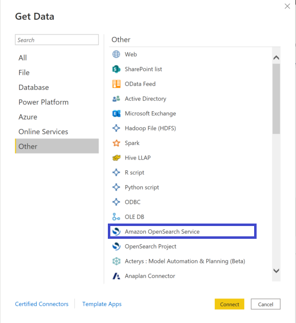
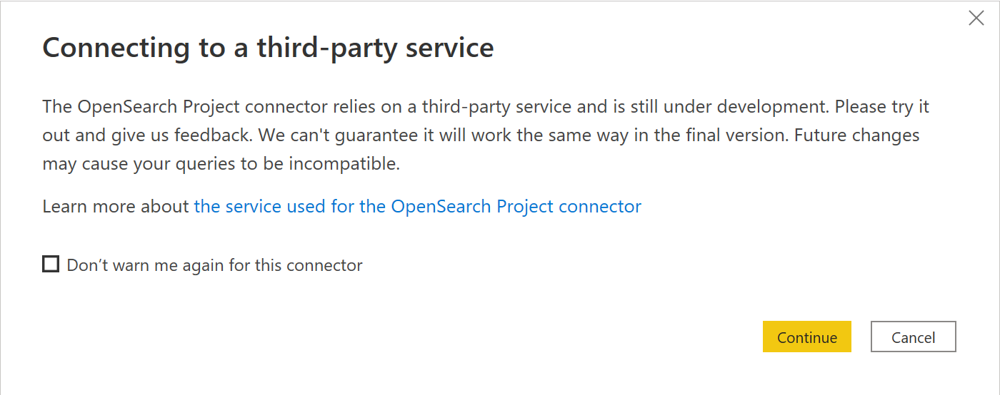
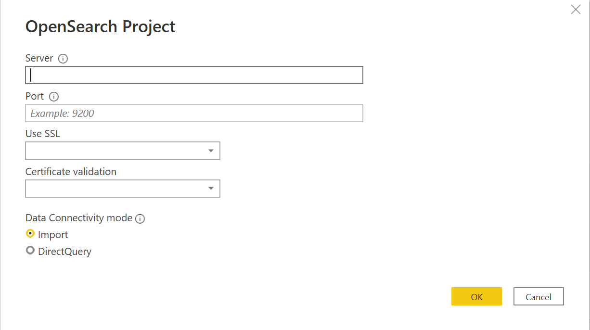
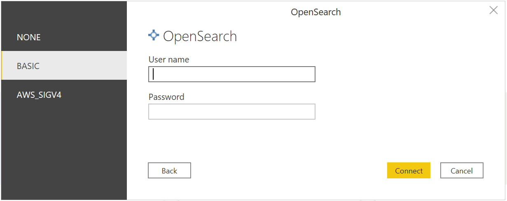
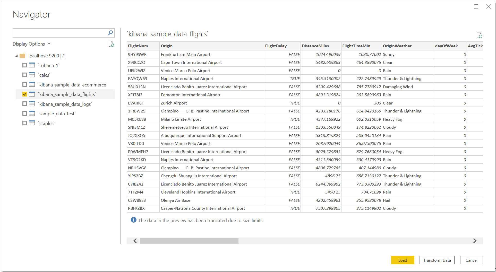
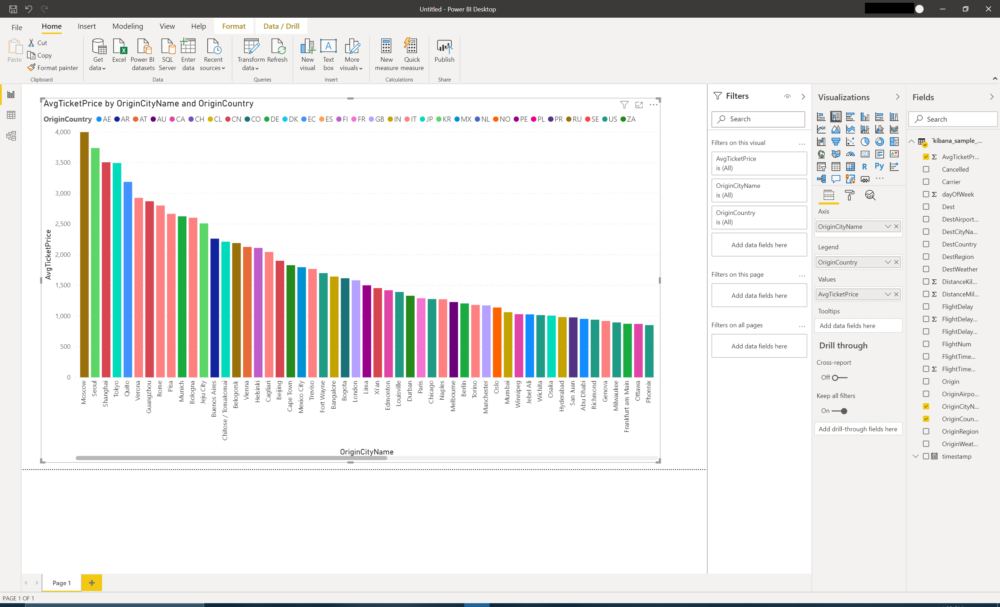
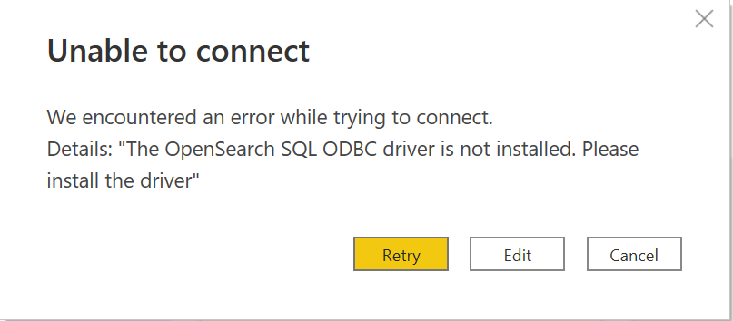
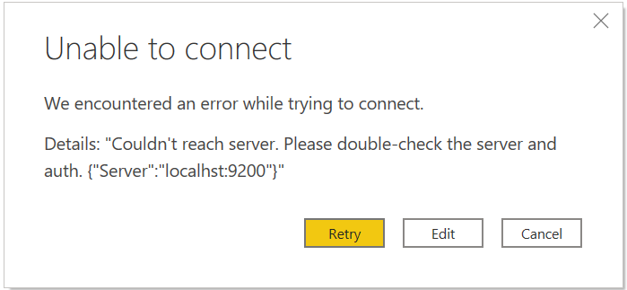
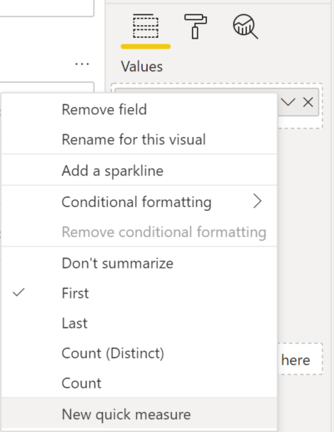
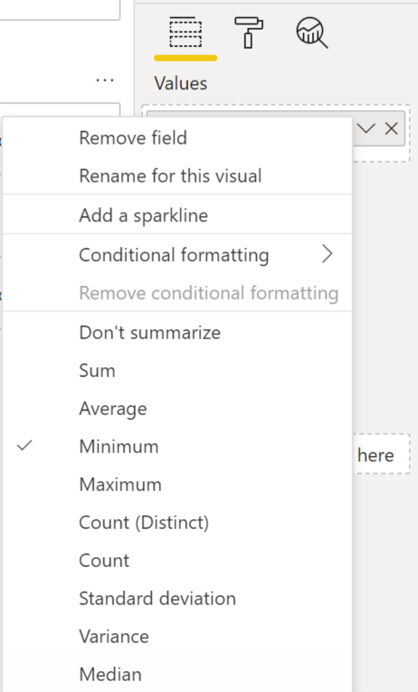

#  Connecting Amazon OpenSearch Service to Microsoft Power BI Desktop

>[!Note]

>The following connector article is provided by Amazon, the owner of this connector and a member of the Microsoft Power Query Connector Certification Program. If you have questions regarding the content of this article or have changes you would like to see made to this article, visit the OpenSearch website and use the support channels there.

## Summary
| Item | Description |
| ---- | ----------- |
| Release State | General Availability |
| Products | Power BI Desktop |
| Authentication Types Supported | Basic |

## Prerequisites
* Microsoft Power BI Desktop
* [OpenSearch](https://opensearch.org/docs/latest/opensearch/install/index/)
* [OpenSearch SQL ODBC driver](https://opensearch.org/docs/latest/search-plugins/sql/odbc/)

## Capabilities supported
* Import
* DirectQuery

## Connect to Amazon OpenSearch Service
1. Open Power BI Desktop.

2. Click on **Home** > **Get Data** > **More** > **Other**. Select **Amazon OpenSearch Service**. Click on **Connect**.

3. You will get a warning for using a third-party service. Click on **Continue**.

4. Enter host and port values and select your preferred SSL option. Click on **OK**.

5. Select authentication option. Enter credentials if required and click on **Connect**.

6. Select required table. Data preview will be loaded.

7. Click on **Load**.

8. Select required columns for creating a graph.

## Troubleshooting 

* If you get the following error, please install the [OpenSearch SQL ODBC Driver](https://docs-beta.opensearch.org/search-plugins/sql/odbc/).

* If you get the following error,

1. Check if host and port values are correct.
2. Check if auth credentials are correct.
3. Check if server is running.

## Limitations and issues

There are known limitations and issues that are tracked by OpenSearch including the items listed below.

| Issue | Description |
| ---- | ----------- |
| Visualizations without numerical columns | Visualizations will only work if there is a numerical column included due to a known limitation in OpenSearch regarding subqueries. An exception to this would be visualizations with columns only of type string works as well. Can be tracked with this [bug](https://github.com/opensearch-project/sql/issues/347) |
| Visualizations with First or Last options selected do not work |  |
| Visualizations with Minimum, Maximum, Standard deviation, Variance, or Median options selected do not work |  |
| Basic filtering limitations | Selecting more than one value does not work when using basic filtering. Due to the issue in the first row of this table, selecting one value for basic filtering when there is no numerical column does not work. |
| Top N filtering limitations | OpenSearch has limitations on subquery which prevents Top N filtering from working. More information can be found [here](https://opensearch.org/docs/latest/search-plugins/sql/limitation/). |
| Advanced filtering limitations | `does not contain` and `does not start with` filters for string columns do not work. All advanced filtering for numerical columns do not work except for `is` and `is blank`. All advanced filtering for date and time columns do not work except for `is blank` and `is not blank`.|
| Relative Date filtering limitations | Due to a known timestamp issue in OpenSearch, all relative date filtering fail to work. |
