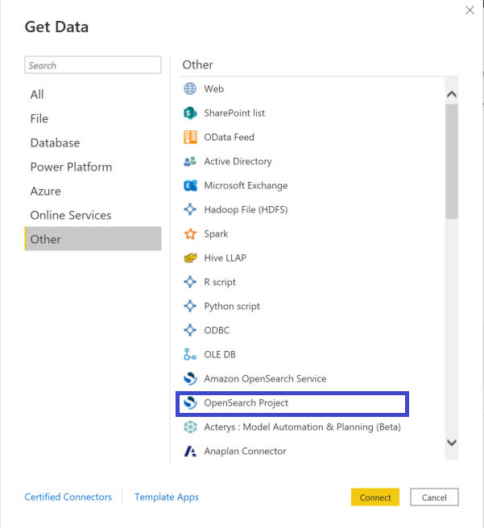
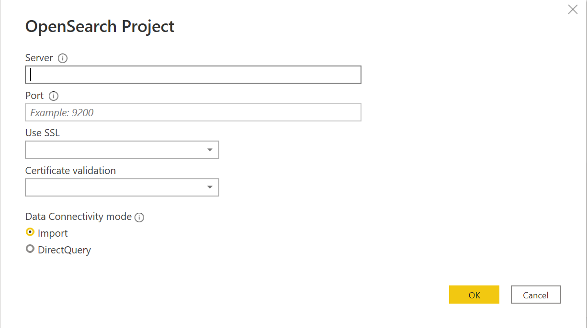

#  Connecting OpenSearch Project to Microsoft Power BI Desktop

>[!Note]

>The following connector article is provided by OpenSearch, the owner of this connector and a member of the Microsoft Power Query Connector Certification Program. If you have questions regarding the content of this article or have changes you would like to see made to this article, visit the OpenSearch website and use the support channels there.

## Summary
| Item | Description |
| ---- | ----------- |
| Release State | General Availability |
| Products | Power BI Desktop |
| Authentication Types Supported | Basic |

## Prerequisites
* Microsoft Power BI Desktop
* [OpenSearch](https://opensearch.org/docs/latest/opensearch/install/index/)
* [OpenSearch SQL ODBC driver](https://opensearch.org/docs/latest/search-plugins/sql/odbc/)

## Capabilities supported
* Import
* DirectQuery

## Connect to OpenSearch Project
1. Open Power BI Desktop.

2. Click on **Home** > **Get Data** > **More** > **Other**. Select **OpenSearch Project**. Click on **Connect**.

3. You will get a warning for using a third-party service. Click on **Continue**.

4. Enter host and port values and select your preferred SSL option. Click on **OK**.

5. Select authentication option. Enter credentials if required and click on **Connect**.

6. Select required table. Data preview will be loaded.

7. Click on **Load**.

8. Select required columns for creating a graph.

## Troubleshooting 

* If you get the following error, please install the [OpenSearch SQL ODBC Driver](https://docs-beta.opensearch.org/search-plugins/sql/odbc/).

* If you get the following error,

1. Check if host and port values are correct.
2. Check if auth credentials are correct.
3. Check if server is running.

