# Pagination in v2 Engine

Pagination allows a SQL plugin client to retrieve arbitrarily large results sets one subset at a time.

A cursor is a SQL abstraction for pagination. A client can open a cursor, retrieve a subset of data given a cursor and close a cursor.

Currently, SQL plugin does not provide SQL cursor syntax. However, the SQL REST endpoint can return result a page at a time. This feature is used by JDBC and ODBC drivers.

# Scope
This document describes pagination in V2 sql engine for non-aggregate queries -- queries 
without `GROUP BY` clause or use of window functions.

# Demo
https://user-images.githubusercontent.com/88679692/224208630-8d38d833-abf8-4035-8d15-d5fb4382deca.mp4

# REST API
## Initial Query Request

Initial query request contains the search request and page size. Search query to OpenSearch is built during processing of this request. Neither the query nor page size can be changed while scrolling through pages based on this request.
The only difference between paged and non-paged requests is `fetch_size` parameter supplied in paged request.

```json
POST /_plugins/_sql
{
    "query" : "...",
    "fetch_size": N
}
```

Response:
```json
{
  "cursor": "<cursor_id>",
  "datarows": [
    ...
  ],
  "schema" : [
    ...
  ]
}
```
`query` is a DQL statement. `fetch_size` is a positive integer, indicating number of rows to return in each page.

If `query` is a DML statement then pagination does not apply, the `fetch_size` parameter is ignored and a cursor is not created. This is existing behaviour in v1 engine.

The client receives an [error response](#error-response) if:
- `fetch_size` is not a positive integer
-  evaluating `query` results in a server-side error
-  `fetch_size` is bigger than `max_window_size` cluster-wide parameter.

## Subsequent Query Request

Subsequent query request contains a cursor only.

```json
POST /_plugins/_sql
{
  "cursor": "<cursor_id>"
}
```
Similarly to v1 engine, the response object is the same as initial response if this is not the last page.

`cursor_id` will be different with each request.

## End of scrolling/paging
The last page in a response will not have a cursor id property.

## Cursor Keep Alive Timeout

Each cursor has a keep alive timer associated with it. When the timer runs out, the cursor is automatically closed by OpenSearch.

This timer is reset every time a page is retrieved.

The client will receive an [error response](#error-response) if it sends a cursor request for an expired cursor.

Keep alive timeout is [configurable](../user/admin/settings.rst#plugins.sql.cursor.keep_alive) by setting `plugins.sql.cursor.keep_alive` and has default value of 1 minute.

## Error Response

The client will receive an error response if any of the above REST calls result in a server-side error.

The response object has the following format:
```json
{
    "error": {
        "details": "<string>",
        "reason": "<string>",
        "type": "<string>"
    },
    "status": <integer>
}
```

`details`, `reason`, and `type` properties are string values. The exact values will depend on the error state encountered.
`status` is an HTTP status code

## OpenSearch Data Retrieval Strategy

OpenSearch provides several data retrieval APIs that are optimized for different use cases.

At this time, SQL plugin uses simple search API and scroll API.

Simple retrieval API returns at most `max_result_window` number of documents.  `max_result_window` is an index setting.

Scroll API requests returns all documents but can incur high memory costs on OpenSearch coordination node.

Efficient implementation of pagination needs to be aware of retrieval API used. Each retrieval strategy will be considered separately.

The discussion below uses *under max_result_window* to refer to scenarios that can be implemented with simple retrieval API and *over max_result_window* for scenarios that require scroll API to implement.

## SQL Node Load Balancing

V2 SQL engine supports *sql node load balancing* &mdash; a cursor request can be routed to any SQL node in a cluster. This is achieved by encoding all data necessary to retrieve the next page in the `cursor_id` property in the response.

## Feature Design
To support pagination, v2 SQL engine needs to:
1. in REST front-end:
    1. Route supported paginated query to v2 engine for
        1. Initial requests,
        2. Next page requests.
    2. Fallback to v1 engine for queries not supported by v2 engine.
    3. Create correct JSON response from execution of paginated physical plan by v2 engine.
2. during query planning:
    1. Differentiate between paginated and normal query plans.
    2. Push down pagination to table scan.
    3. Create a physical query plan from a cursor id.
3. during query execution:
   1. Serialize an executing query and generate a cursor id after returning `fetch_size` number of elements.
4. in OpenSearch data source: 
    1. Support pagination push down.
    2. Support other push down optimizations with pagination.

### Query Plan Changes

All three kinds of query requests &mdash; non-paged, initial page, or subsequent page  &mdash; are processed in the same way. Simplified workflow of query plan processing is shown below for reference.

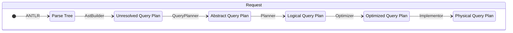


#### Unresolved Query Plan

Unresolved Query Plan for non-paged requests remains unchanged. 

To support initial query requests, the `QueryPlan` class has a new optional field `pageSize`.


When `QueryPlanFactory.create` is passed initial query request, it:
1. Adds an instance of `Paginate` unresolved plan as the root of the unresolved query plan.
2. Sets `pageSize` parameter in `QueryPlan`.

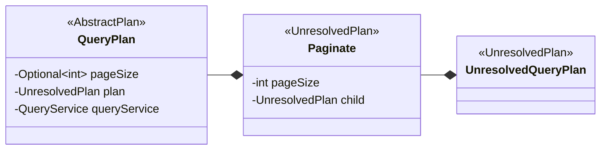

When `QueryPlanFactory.create` is passed a subsequent query request, it:
1. Creates an instance of `FetchCursor` unresolved plan as the sole node in the unresolved query plan.

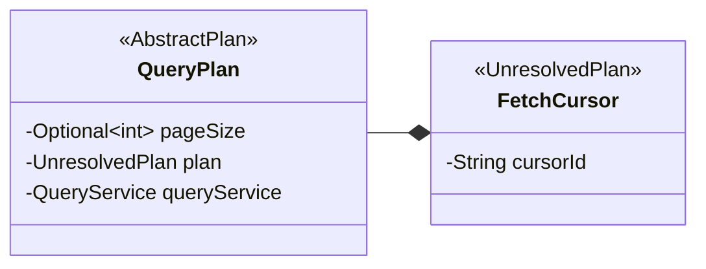

The examples below show Abstract Query Plan for the same query in different request types:

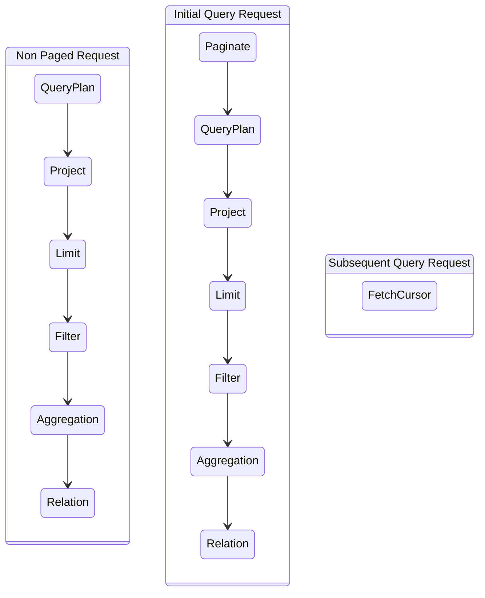

#### Logical Query Plan

There are no changes for non-paging requests.

Changes to logical query plan to support Initial Query Request:
1. `LogicalPaginate` is added to the top of the tree. It stores information about paging should be done in a private field `pageSize` being pushed down in the `Optimizer`.

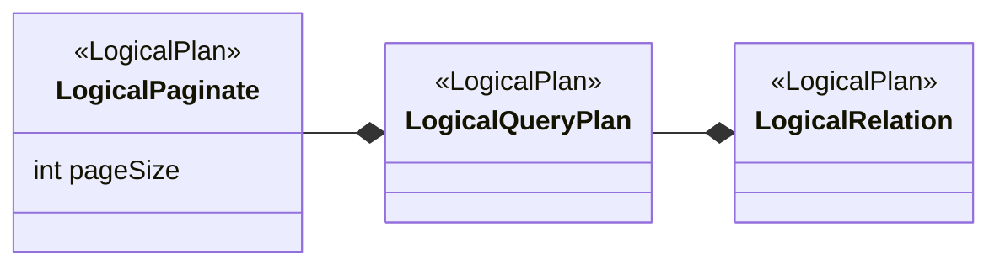

For subsequent page requests, `FetchCursor` unresolved plan is mapped to `LogicalFetchCursor` logical plan.

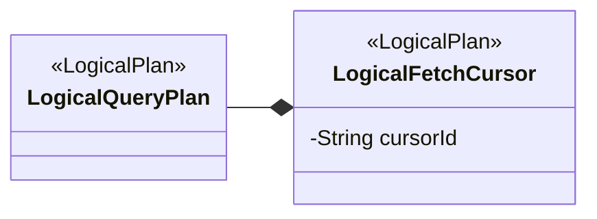

The examples below show logical query plan for the same query in different request types:

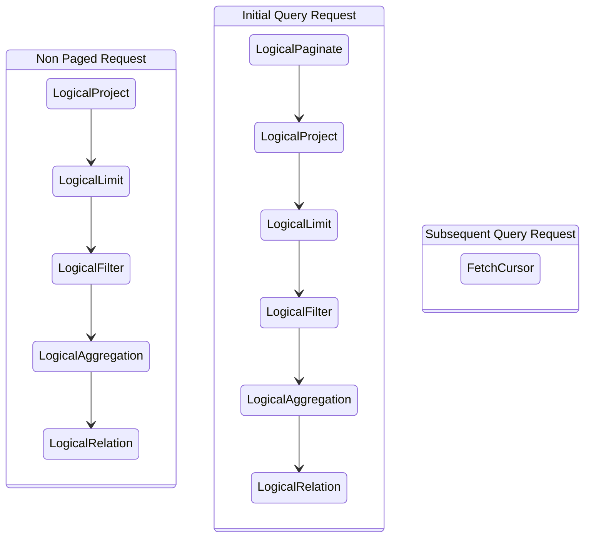


#### Optimized Logical Query Plan

Pagination is implemented by push down to OpenSearch. The following is only relevant for
initial paged requests. Non-paged request optimization was not changed and there is no optimization
to be done for subsequent page query plans.

Push down logical is implemented in  `OpenSearchIndexScanQueryBuilder.pushDownPageSize` method.
This method is called by `PushDownPageSize` rule during plan optimization.  `LogicalPaginate` is removed from the query plan during push down operation in `Optimizer`.

See [article about `TableScanBuilder`](query-optimizer-improvement.md#TableScanBuilder) for more details.

The examples below show optimized Logical Query Plan for the same query in different request types:

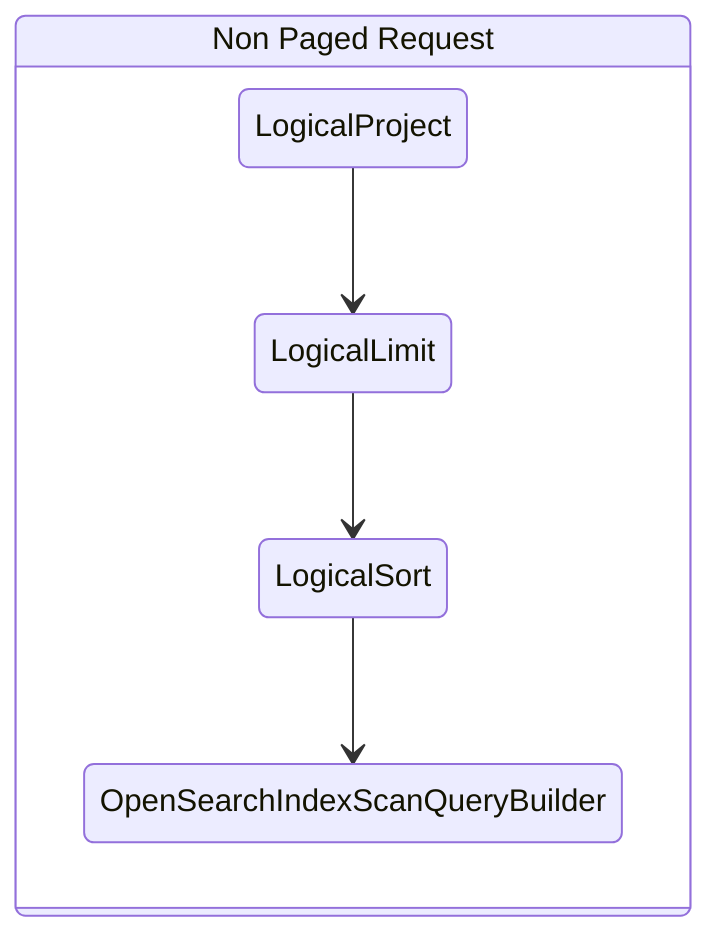

#### Physical Query Plan and Execution

Changes:
1. `OpenSearchIndexScanBuilder` is converted to `OpenSearchIndexScan` by `Implementor`.
2. `LogicalPlan.pageSize` is mapped to `OpenSearchIndexScan.maxResponseSize`. This is the limit to  the number of elements in a response.
2. Entire Physical Query Plan is created by `PlanSerializer` for Subsequent Query requests. The deserialized plan has the same structure as the Initial Query Request.
3. Implemented serialization and deserialization for `OpenSearchScrollRequest`.


The examples below show physical query plan for the same query in different request types:

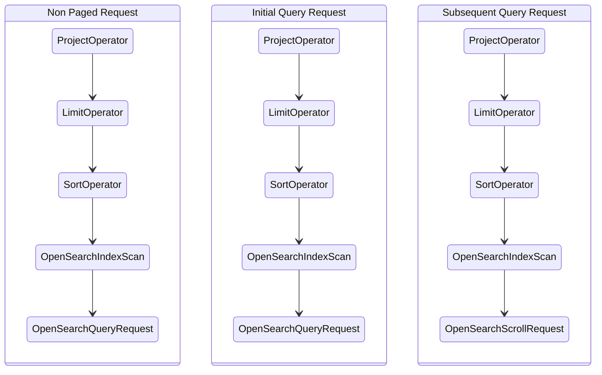

### Architecture Diagrams

New code workflows which added by Pagination feature are highlighted.

#### Non Paging Query Request

A non-paging request sequence diagram is shown below for comparison: 


#### Initial Query Request

Processing of an Initial Query Request has few extra steps comparing versus processing a regular Query Request:
1. Query validation with `CanPaginateVisitor`. This is required to validate whether incoming query can be paged. This also activate legacy engine fallback mechanism.
2. `Serialization` is performed by `PlanSerializer` - it converts Physical Plan Tree into a cursor, which could be used query a next page.

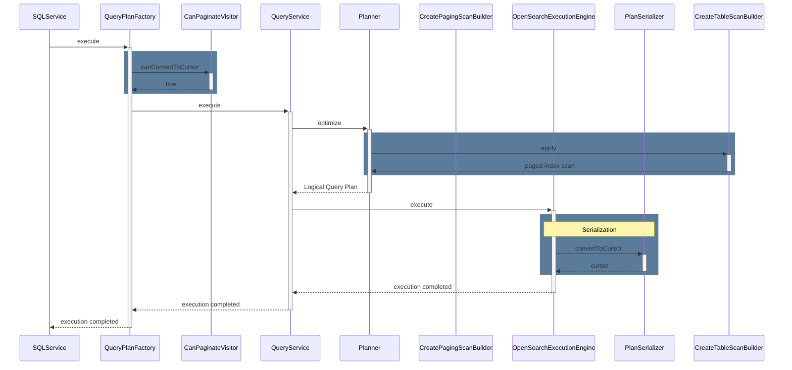

#### Subsequent Query Request

Subsequent pages are processed by a new workflow. The key point there:
1. `Deserialization` is performed by `PlanSerializer` to restore entire Physical Plan Tree encoded into the cursor.
2. Since query already contains the Physical Plan Tree, all tree processing steps are skipped.
3. `Serialization` is performed by `PlanSerializer` - it converts Physical Plan Tree into a cursor, which could be used query a next page.

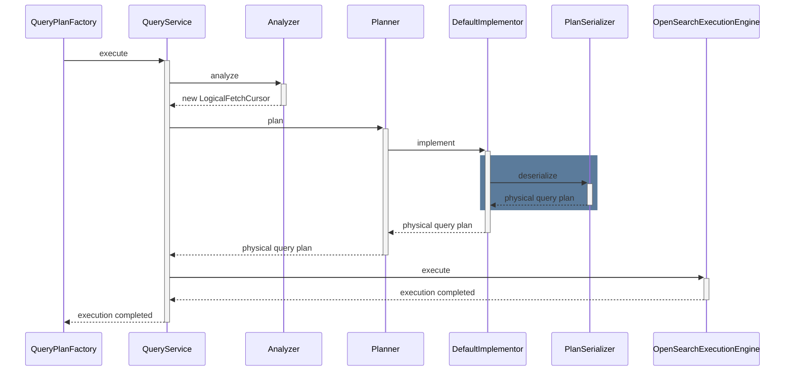

#### Legacy Engine Fallback

Since pagination in V2 engine supports fewer SQL commands than pagination in legacy engine, a fallback mechanism is created to keep V1 engine features still available for the end user. Pagination fallback is backed by a new exception type which allows legacy engine to intersect execution of a request.

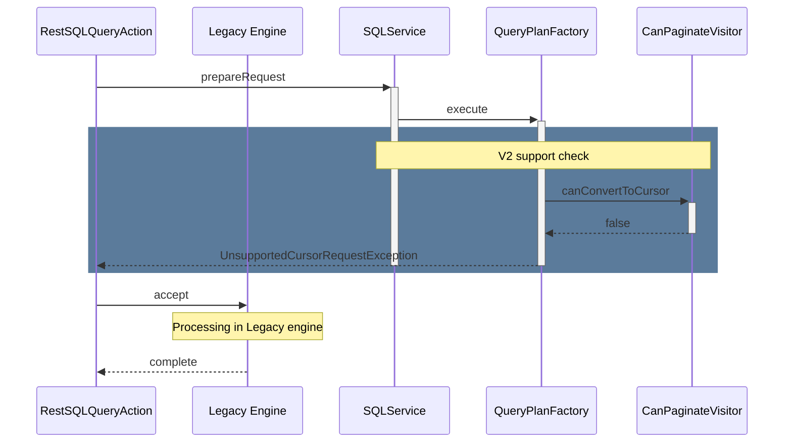

#### Serialization and Deserialization round trip

The SQL engine should be able to completely recover the Physical Query Plan to continue its execution to get the next page. Serialization mechanism is responsible for recovering the query plan. note: `ResourceMonitorPlan` isn't serialized, because a new object of this type would be created for the restored query plan before execution. 
Serialization and Deserialization are performed by Java object serialization API.

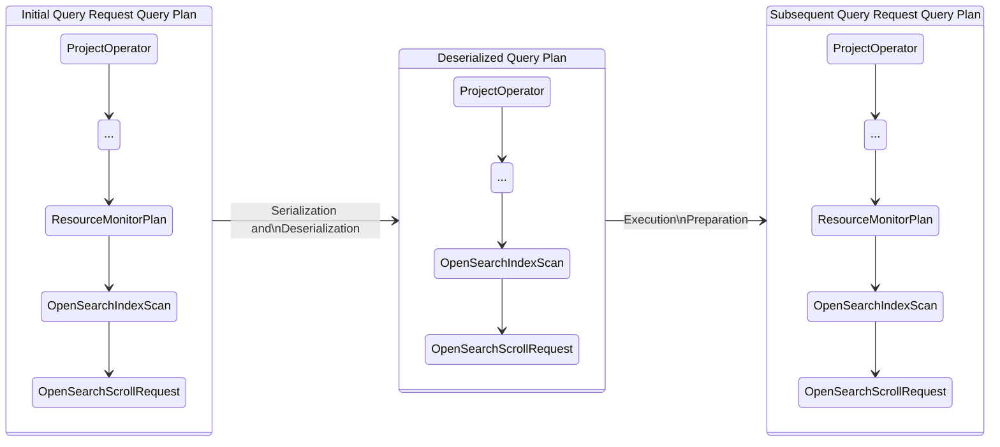

#### Serialization

All query plan nodes which are supported by pagination should implement [`SerializablePlan`](https://github.com/opensearch-project/sql/blob/f40bb6d68241e76728737d88026e4c8b1e6b3b8b/core/src/main/java/org/opensearch/sql/planner/SerializablePlan.java) interface. `getPlanForSerialization` method of this interface allows serialization mechanism to skip a tree node from serialization. OpenSearch search request objects are not serialized, but search context provided by the OpenSearch cluster is extracted from them.

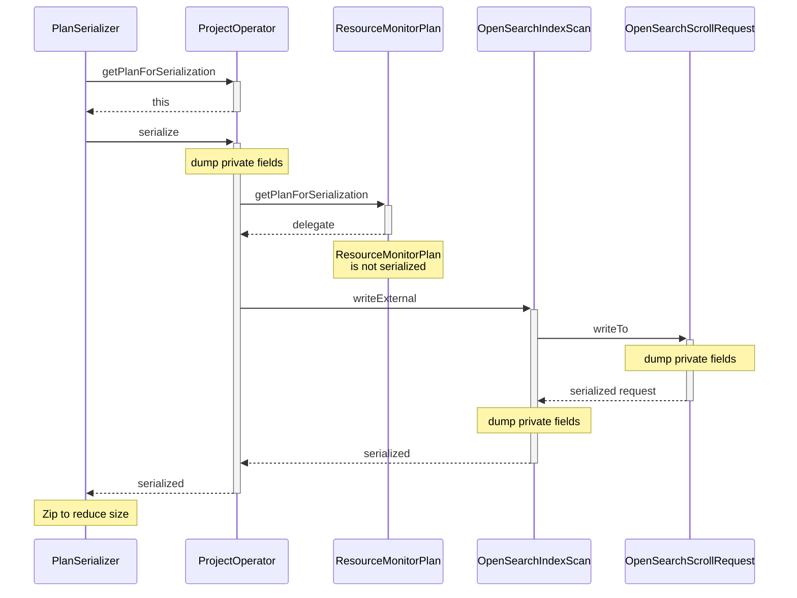

#### Deserialization

Deserialization restores previously serialized Physical Query Plan. The recovered plan is ready to execute and returns the next page of the search response. To complete the query plan restoration, SQL engine will build a new request to the OpenSearch node. This request doesn't contain a search query, but it contains a search context reference &mdash; `scrollID`. To create a new `OpenSearchScrollRequest` object it requires access to the instance of `OpenSearchStorageEngine`. Note: `OpenSearchStorageEngine` can't be serialized, and it exists as a singleton in the SQL plugin engine. `PlanSerializer` creates a customized deserialization binary object stream &mdash; `CursorDeserializationStream`. This stream provides an interface to access the `OpenSearchStorageEngine` object.

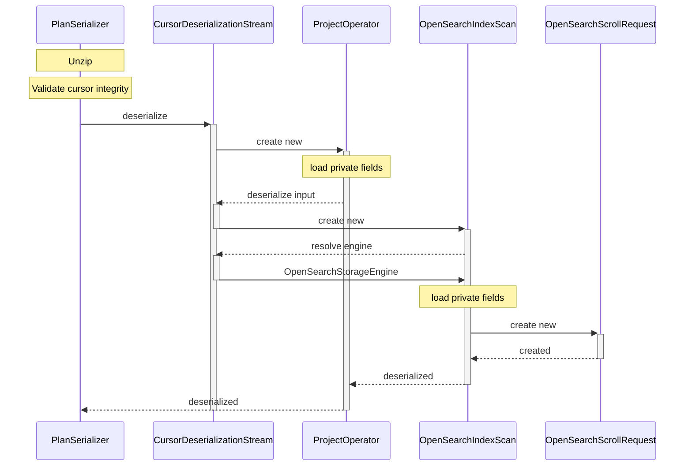

#### Close Cursor

A user can forcibly close a cursor (scroll) at any moment of paging. Automatic close occurs when paging is complete and no more results left.
Close cursor protocol defined by following:
1. REST endpoint: `/_plugins/_sql/close`
2. Request type: `POST`
3. Request format:
```json
{
    "cursor" : "<cursor>"
}
```
4. Response format:
```json
{
    "succeeded": true
}
```
5. Failure or error: [error response](#error-response)
6. Use or sequential close of already closed cursor produces the same error as use of expired/auto-closed/non-existing cursor.

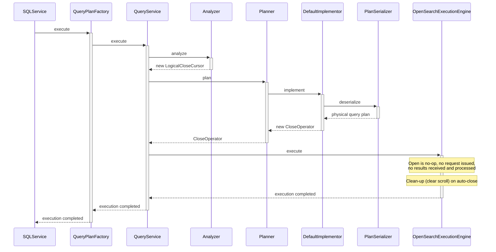

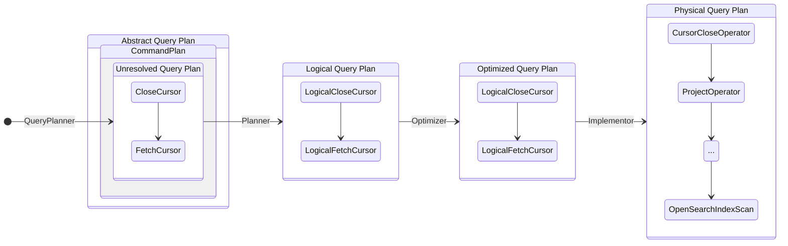

`CursorCloseOperator` provides a dummy (empty, since not used) `Schema`, does not perform `open` and always returns `false` by `hasNext`. Such behavior makes it a no-op operator which blocks underlying Physical Plan Tree from issuing any search request, but does not block auto-close provided by `AutoCloseable`. Default close action clears scroll context.
Regular paging doesn't execute scroll clear, because it checks whether paging is finished or not and raises a flag to prevent clear. This check performed when search response recevied, what never happen due to `CursorCloseOperator`.

```py
class OpenSearchScrollRequest:
  bool needClean = true

  def search:
    ...
    needClean = response.isEmpty()

  def clean:
    if needClean:
      clearScroll()
```

```py
class CursorCloseOperator(PhysicalPlan):
  PhysicalPlan tree
  def open:
    pass
    # no-op, don't propagate `open` of underlying plan tree

  def hasNext:
    return false
```

```py
class PhysicalPlan:
  def open:
    innerPlan.open()

  def close:
    innerPlan.close()
```
