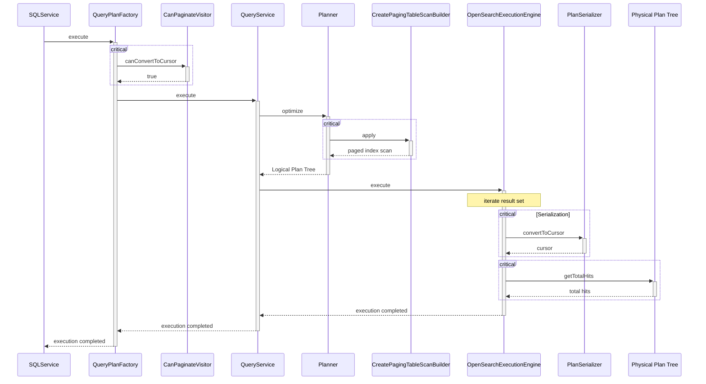
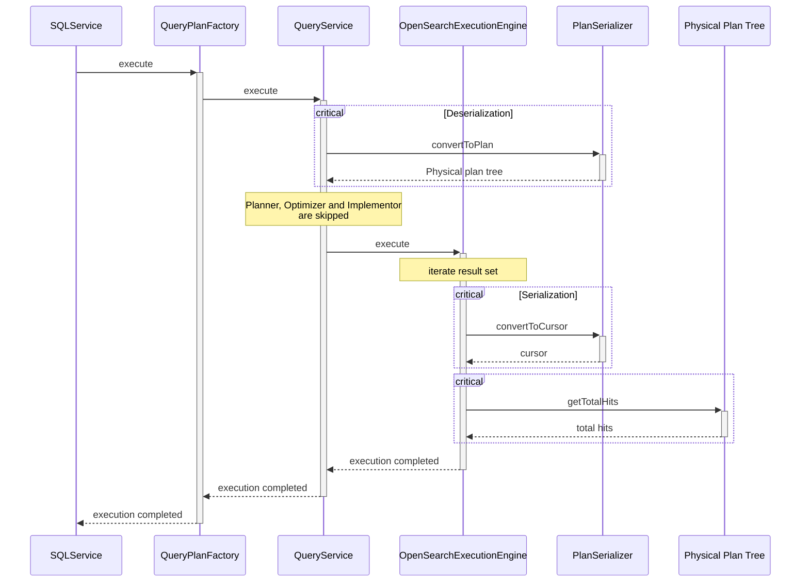
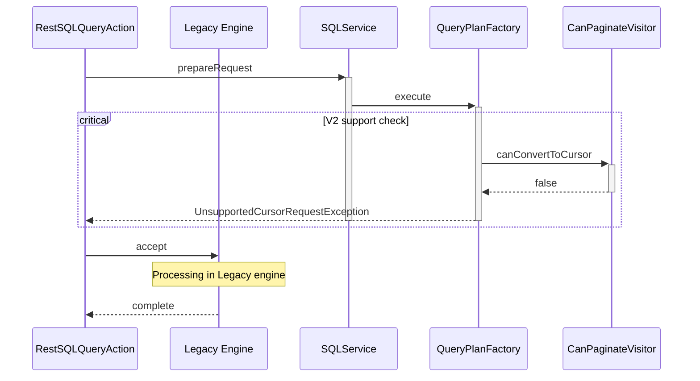
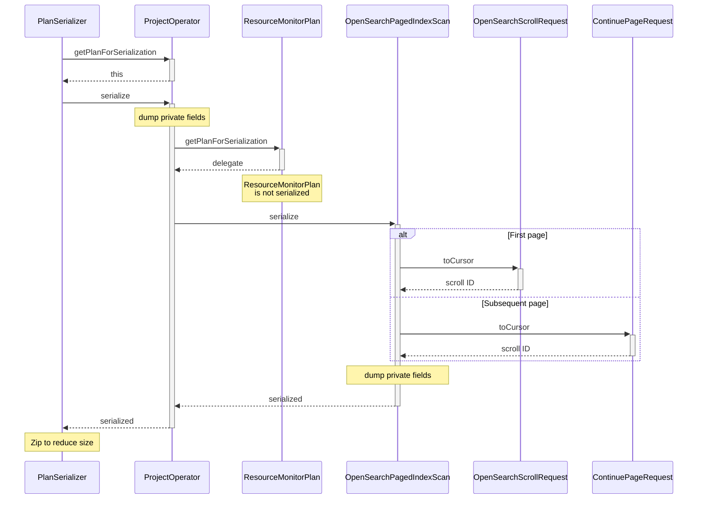
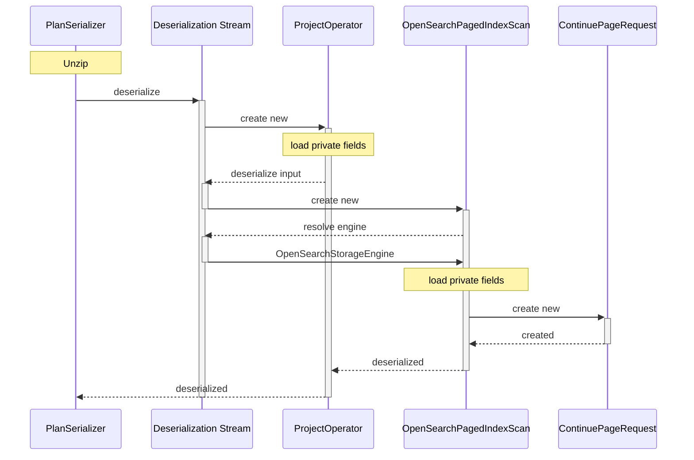
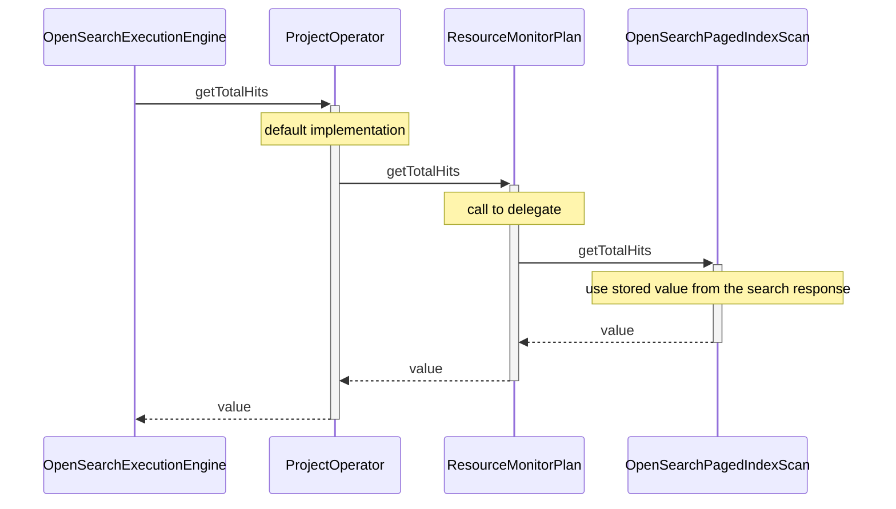

# Pagination in v2 Engine

Pagination allows a SQL plugin client to retrieve arbitrarily large results sets one subset at a time.

A cursor is a SQL abstraction for pagination. A client can open a cursor, retrieve a subset of data given a cursor and close a cursor.

Currently, SQL plugin does not provide SQL cursor syntax. However, the SQL REST endpoint can return result a page at a time. This feature is used by JDBC and ODBC drivers.


# Scope
Currenty, V2 engine supports pagination only for simple `SELECT * FROM <table>` queries without any other clauses like `WHERE` or `ORDER BY`.

# Demo
https://user-images.githubusercontent.com/88679692/224208630-8d38d833-abf8-4035-8d15-d5fb4382deca.mp4

# REST API
## Initial Query Request
```json
POST /_plugins/_sql
{
    "query" : "...",
    "fetch_size": N
}
```

Response:
```json
{
  "cursor": /* cursor_id */,
  "datarows": [
    // ...
  ],
  "schema" : [
    // ...
  ]
}
```
`query` is a DQL statement. `fetch_size` is a positive integer, indicating number of rows to return in each page.

If `query` is a DML statement then pagination does not apply, the `fetch_size` parameter is ignored and a cursor is not created. This is existing behaviour in v1 engine.

The client receives an (error response](#error-response) if:
- `fetch_size` is not a positive integer, or
-  evaluating `query` results in a server-side error.

## Next Page Request
```json
POST /_plugins/_sql
{
  "cursor": "<cursor_id>"
}
```
Similarly to v1 engine, the response object is the same as initial response if this is not the last page.

`cursor_id` will be different with each request.

If this is the last page, the `cursor` property is ommitted. The cursor is closed automatically.

The client will receive an [error response](#error-response) if executing this request results in an OpenSearch or SQL plug-in error.

## Cursor Keep Alive Timeout
Each cursor has a keep alive timer associated with it. When the timer runs out, the cursor is closed by OpenSearch.

This timer is reset every time a page is retrieved.

The client will receive an [error response](#error-response) if it sends a cursor request for an expired cursor.

## Error Response
The client will receive an error response if any of the above REST calls result in an server-side error.

The response object has the following format:
```json
{
    "error": {
        "details": <string>,
        "reason": <string>,
        "type": <string>
    },
    "status": <integer>
}
```

`details`, `reason`, and `type` properties are string values. The exact values will depend on the error state encountered.
`status` is an HTTP status code

## OpenSearch Data Retrieval Strategy

OpenSearch provides several data retrival APIs that are optimized for different use cases.

At this time, SQL plugin uses simple search API and scroll API.

Simple retrieval API returns at most `max_result_window` number of documents.  `max_result_window` is an index setting.

Scroll API requests returns all documents but can incur high memory costs on OpenSearch coordination node.

Efficient implementation of pagination needs to be aware of retrival API used. Each retrieval strategy will be considered separately.

The discussion below uses *under max_result_window* to refer to scenarios that can be implemented with simple retrieval API and *over max_result_window* for scenarios that require scroll API to implement.

## SQL Node Load Balancing
V2 SQL engine supports *sql node load balancing* -- a cursor request can be routed to any SQL node in a cluster. This is achieved by encoding all data necessary to retrieve the next page in the `cursor_id`.

## Design Diagrams
New code workflows are highlighted.

### First page


### Second page

### Legacy Engine Fallback


### Serialization


### Deserialization


### Total Hits

Total Hits is the number of rows matching the search criteria; with `select *` queries it is equal to row (doc) number in the table (index).
Example:
Paging thru `SELECT * FROM calcs` (17 rows) with `fetch_size = 5` returns:

* Page 1: total hits = 17, result size = 5, cursor
* Page 2: total hits = 17, result size = 5, cursor
* Page 3: total hits = 17, result size = 5, cursor
* Page 4: total hits = 17, result size = 2, cursor
* Page 5: total hits = 0, result size = 0

Default implementation of `getTotalHits` in a Physical Plan iterate child plans down the tree and gets the maximum value or 0.


