# Pagination in v2 Engine

Pagination allows a SQL plugin client to retrieve arbitrarily large results sets one subset at a time.

A cursor is a SQL abstraction for pagination. A client can open a cursor, retrieve a subset of data given a cursor and close a cursor.

Currently, SQL plugin does not provide SQL cursor syntax. However, the SQL REST endpoint can return result a page at a time. This feature is used by JDBC and ODBC drivers.

# Scope
Currenty, V2 engine supports pagination only for simple `SELECT * FROM <table>` queries without any other clauses like `WHERE` or `ORDER BY`.

# Demo
https://user-images.githubusercontent.com/88679692/224208630-8d38d833-abf8-4035-8d15-d5fb4382deca.mp4

# REST API
## Initial Query Request

Initial query request contains the search request and page size. Search query to OpenSearch is built during processing of this request. Neither the query nor page size can be change while scrolling through pages based on this request.
The only difference between paged and non-paged requests is `fetch_size` parameter supplied in paged request.

```json
POST /_plugins/_sql
{
    "query" : "...",
    "fetch_size": N
}
```

Response:
```json
{
  "cursor": "<cursor_id>",
  "datarows": [
    ...
  ],
  "schema" : [
    ...
  ]
}
```
`query` is a DQL statement. `fetch_size` is a positive integer, indicating number of rows to return in each page.

If `query` is a DML statement then pagination does not apply, the `fetch_size` parameter is ignored and a cursor is not created. This is existing behaviour in v1 engine.

The client receives an [error response](#error-response) if:
- `fetch_size` is not a positive integer
-  evaluating `query` results in a server-side error
-  `fetch_size` is bigger than `max_window_size` cluster-wide parameter.

## Subsequent Query Request

Subsequent query request contains a cursor only.

```json
POST /_plugins/_sql
{
  "cursor": "<cursor_id>"
}
```
Similarly to v1 engine, the response object is the same as initial response if this is not the last page.

`cursor_id` will be different with each request.

## End of scrolling/paging

When scrolling is finished, SQL plugin returns a final cursor. This cursor leads to an empty page, which has no cursor and no data hits. Receiving that page means all data was properly queried, and the scrolling cursor has been closed.

The client will receive an [error response](#error-response) if executing this request results in an OpenSearch or SQL plug-in error.

## Cursor Keep Alive Timeout

Each cursor has a keep alive timer associated with it. When the timer runs out, the cursor is automatically closed by OpenSearch.

This timer is reset every time a page is retrieved.

The client will receive an [error response](#error-response) if it sends a cursor request for an expired cursor.

Keep alive timeout is [configurable](../user/admin/settings.rst#plugins.sql.cursor.keep_alive) by setting `plugins.sql.cursor.keep_alive` and has default value of 1 minute.

## Error Response

The client will receive an error response if any of the above REST calls result in an server-side error.

The response object has the following format:
```json
{
    "error": {
        "details": "<string>",
        "reason": "<string>",
        "type": "<string>"
    },
    "status": <integer>
}
```

`details`, `reason`, and `type` properties are string values. The exact values will depend on the error state encountered.
`status` is an HTTP status code

## OpenSearch Data Retrieval Strategy

OpenSearch provides several data retrival APIs that are optimized for different use cases.

At this time, SQL plugin uses simple search API and scroll API.

Simple retrieval API returns at most `max_result_window` number of documents.  `max_result_window` is an index setting.

Scroll API requests returns all documents but can incur high memory costs on OpenSearch coordination node.

Efficient implementation of pagination needs to be aware of retrival API used. Each retrieval strategy will be considered separately.

The discussion below uses *under max_result_window* to refer to scenarios that can be implemented with simple retrieval API and *over max_result_window* for scenarios that require scroll API to implement.

## SQL Node Load Balancing

V2 SQL engine supports *sql node load balancing* -- a cursor request can be routed to any SQL node in a cluster. This is achieved by encoding all data necessary to retrieve the next page in the `cursor_id`.

## Feature Design

### Plan Tree changes

Different plan trees are built during request processing. Read more about their purpose and stages [here](query-optimizer-improvement.md#Examples). The section below describes the changes being introduced to these trees by the pagination feature.

Simplified workflow of plan trees is shown below. Initial Page Request is processed the same way as a non-paging request.

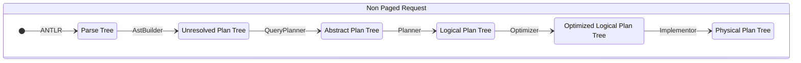

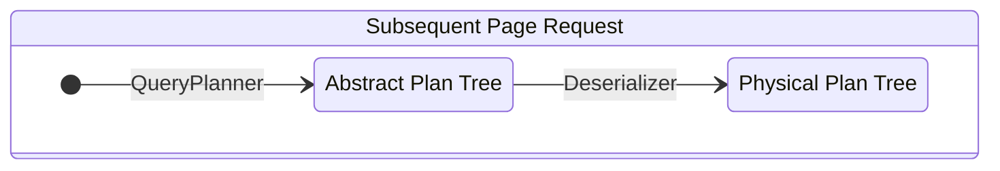

New plan tree workflow was added for Subsequent Page Requests. Since a final Physical Plan tree was already created for Initial request, subsequent requests should have the same tree. The tree is serialized into a `cursor` by `PlanSerializer` to be de-serialized on the subsequence Page Request. Query parsing and analysis is not performed for Subsequent Page Requests, since the Physical Plan tree is instead de-serialized from the `cursor`.

#### Abstract Plan tree

Abstract Plan Tree for non-paged requests remains unchanged. The `QueryPlan`, as a top entry, has a new optional field `pageSize`, which is not defined for non-paged requests.

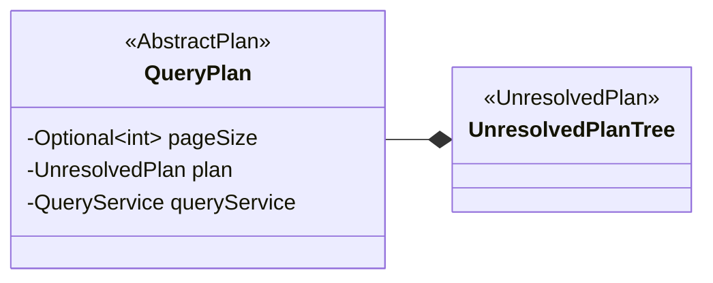

Abstract plan tree for Initial Query Request has following changes:
1. New Plan node -- `Paginate` -- added into the tree.
2. `pageSize` parameter in `QueryPlan` is set, and `Paginate` is being added. It is converted to `LogicalPaginate` later.

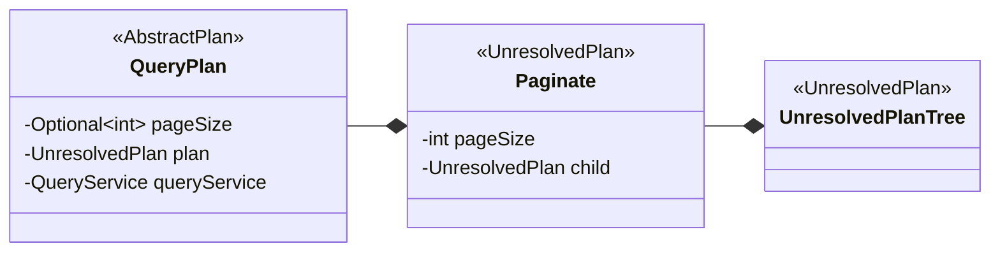

Non-paging requests have the same plan tree, but `pageSize` value in `QueryPlan` is unset.

Abstract plan tree for Subsequent Query Request (for second and further pages) contains only one node -- `ContinuePaginatedPlan`.

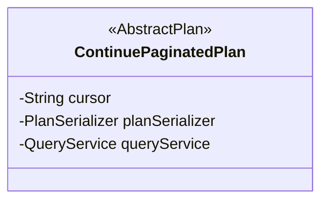

`ContinuePaginatedPlan` translated to entire Physical Plan Tree by `PlanSerializer` on cursor deserialization. It bypasses Logical Plan tree stage, `Planner`, `Optimizer` and `Implementor`.

The examples below show Abstract Plan Tree for the same query in different request types:

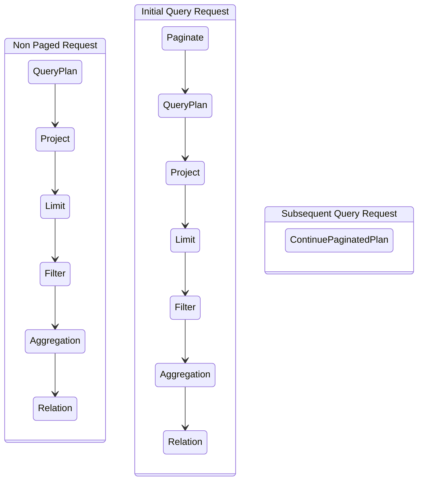

#### Logical Plan tree

Changes to plan tree for Initial Query Request with pagination:
1. `LogicalPaginate` is added to the top of the tree. It stores information about paging/scrolling should be done in a private field `pageSize` being pushed down in the `Optimizer`.

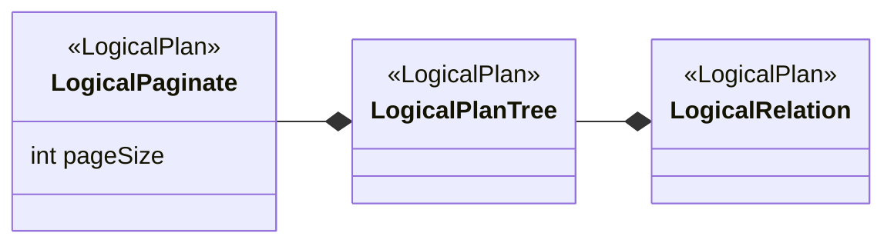

There are no changes for non-paging requests.

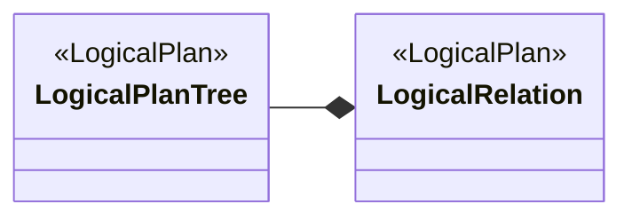

Note: This step is not executed for Subsequent Query Request.

The examples below show Logical Plan Tree for the same query in different request types:

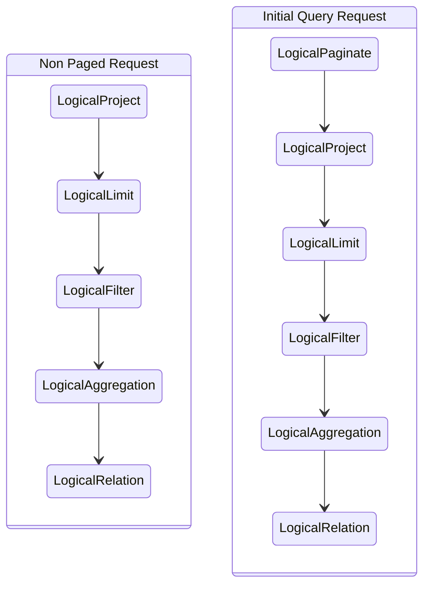

#### Optimized Logical Plan tree

Changes:
1. For pagination request, a `OpenSearchPagedIndexScanBuilder` is inserted to the bottom of the tree instead of `OpenSearchIndexScanQueryBuilder`. Both are instances of `TableScanBuilder` which extends `LogicalPlan` interface.
2. `LogicalPaginate` is removed from the tree during push down operation in `Optimizer`.

See [article about `TableScanBuilder`](query-optimizer-improvement.md#TableScanBuilder) for more details.

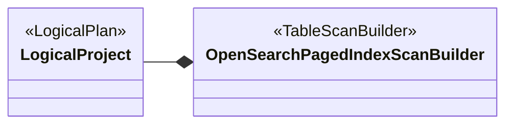

Note: No Logical Plan tree created for Subsequent Query Request.

The examples below show optimized Logical Plan Tree for the same query in different request types:

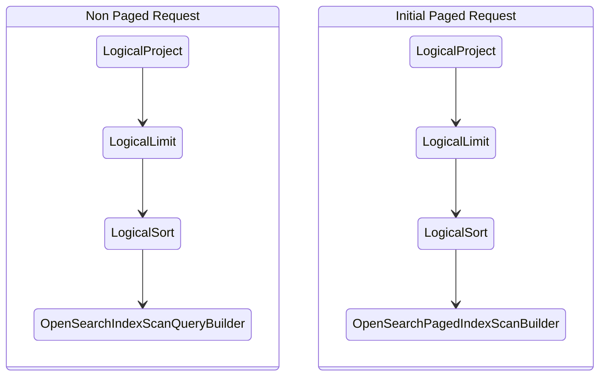

#### Physical Plan tree

Changes:
1. `OpenSearchPagedIndexScanBuilder` is converted to `OpenSearchPagedIndexScan` by `Implementor`.
2. Entire Physical Plan tree is created by `PlanSerializer` for Subsequent Query requests. The deserialized tree has the same structure as the Initial Query Request.

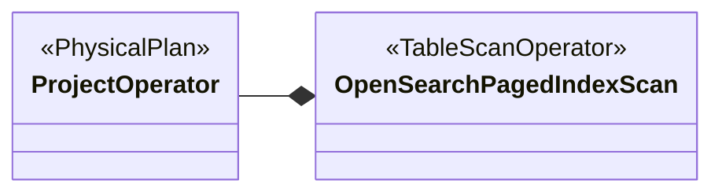

The examples below show Physical Plan Tree for the same query in different request types:

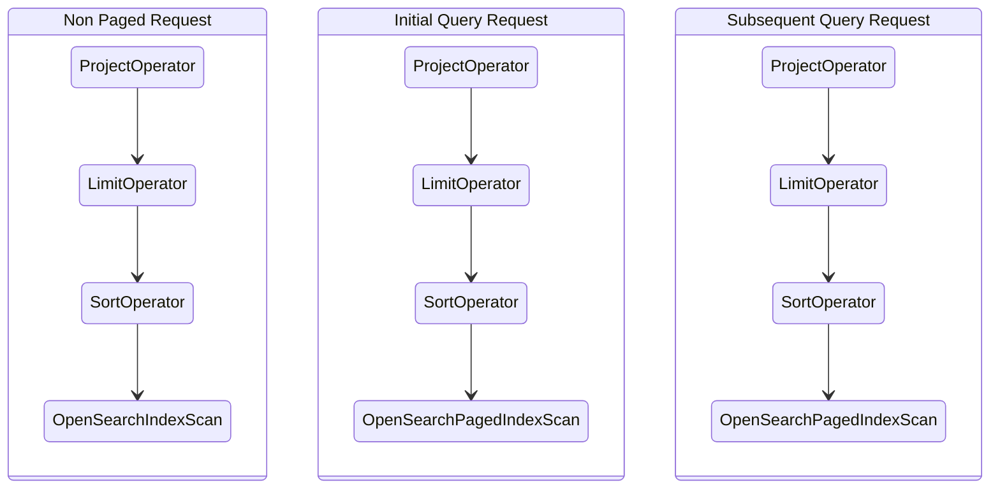

### Architecture Diagrams

New code workflows which added by Pagination feature are highlighted.

#### Non Paging Query Request

A non-paging request sequence diagram is shown below for comparison: 

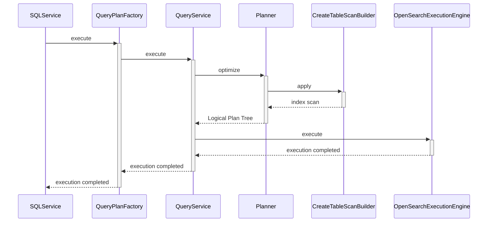

#### Initial Query Request

Processing of an Initial Query Request has few extra steps comparing versus processing a regular Query Request:
1. Query validation with `CanPaginateVisitor`. This is required to validate whether incoming query can be paged. This also activate legacy engine fallback mechanism.
2. Creating a paged index scan with `CreatePagingTableScanBuilder` `Optimizer` rule. A Regular Query Request triggers `CreateTableScanBuilder` rule instead.
3. `Serialization` is performed by `PlanSerializer` - it converts Physical Plan Tree into a cursor, which could be used query a next page.
4. Traversal of Physical Plan Tree to get total hits, which is required to properly fill response to a user.

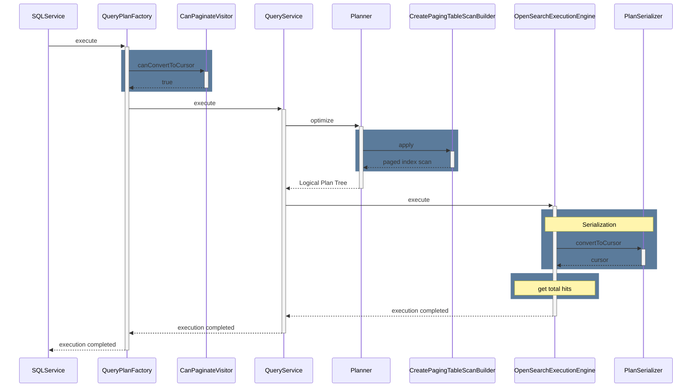

#### Subsequent Query Request

Subsequent pages are processed by a new workflow. The key point there:
1. `Deserialization` is performed by `PlanSerializer` to restore entire Physical Plan Tree encoded into the cursor.
2. Since query already contains the Physical Plan Tree, all tree processing steps are skipped.
3. `Serialization` is performed by `PlanSerializer` - it converts Physical Plan Tree into a cursor, which could be used query a next page.
4. Traversal of Physical Plan Tree to get total hits, which is required to properly fill response to a user.

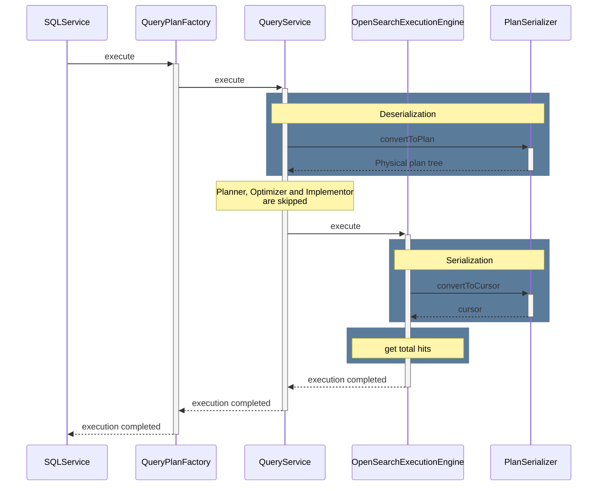

#### Legacy Engine Fallback

Since pagination in V2 engine supports fewer SQL commands than pagination in legacy engine, a fallback mechanism is created to keep V1 engine features still available for the end user. Pagination fallback is backed by a new exception type which allows legacy engine to intersect execution of a request.

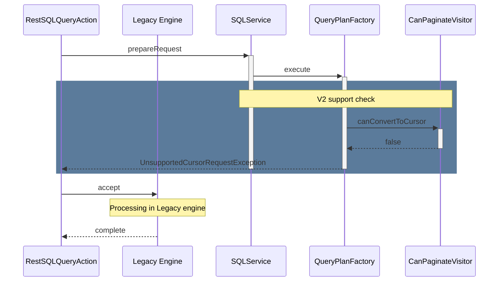

#### Serialization and Deserialization round trip

The SQL engine should be able to completely recover the Physical Plan tree to continue its execution to get the next page. Serialization mechanism is responsible for recovering the plan tree. note: `ResourceMonitorPlan` isn't serialized, because a new object of this type would be created for the restored plan tree before execution. 
Serialization and Deserialization are performed by Java object serialization API.

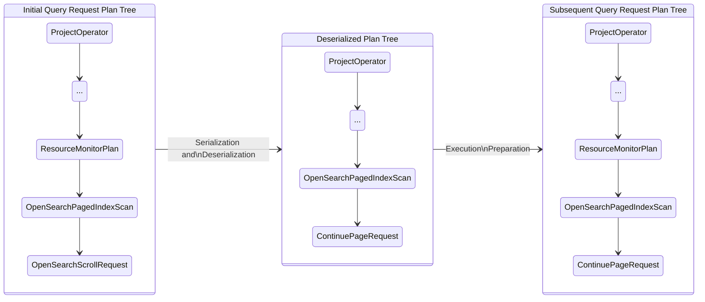

#### Serialization

All plan tree nodes which are supported by pagination should implement [`SerializablePlan`](https://github.com/opensearch-project/sql/blob/f40bb6d68241e76728737d88026e4c8b1e6b3b8b/core/src/main/java/org/opensearch/sql/planner/SerializablePlan.java) interface. `getPlanForSerialization` method of this interface allows serialization mechanism to skip a tree node from serialization. OpenSearch search request objects are not serialized, but search context provided by the OpenSearch cluster is extracted from them.

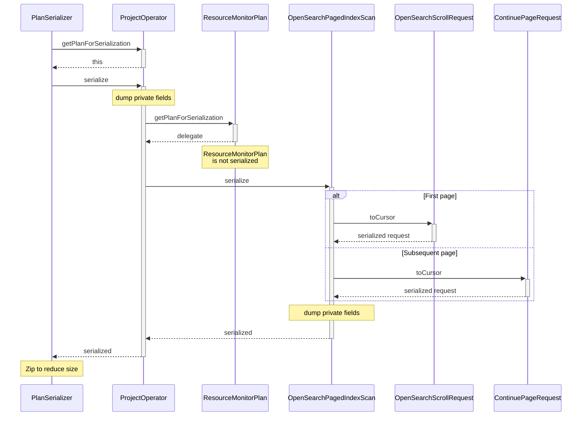

#### Deserialization

Deserialization restores previously serialized Physical Plan tree. The recovered tree is ready to execute and should return the next page of the search response. To complete the tree restoration, SQL engine should build a new request to the OpenSearch node. This request doesn't contain a search query, but it contains a search context reference -- `scrollID`. To create a new `ContinuePageRequest` object it is require to access to the instance of `OpenSearchStorageEngine`. `OpenSearchStorageEngine` can't be serialized and it exists as a singleton in the SQL plugin engine. `PlanSerializer` creates a customized deserialization binary object stream -- `CursorDeserializationStream`. This stream provides an interface to access the `OpenSearchStorageEngine` object.

```mermaid
sequenceDiagram
    participant PlanSerializer
    participant CursorDeserializationStream
    participant ProjectOperator
    participant OpenSearchPagedIndexScan
    participant ContinuePageRequest

Note over PlanSerializer : Unzip
Note over PlanSerializer : Validate cursor integrity
PlanSerializer ->>+ CursorDeserializationStream : deserialize
  CursorDeserializationStream ->>+ ProjectOperator : create new
    Note over ProjectOperator: load private fields
    ProjectOperator -->> CursorDeserializationStream : deserialize input
  activate CursorDeserializationStream
  CursorDeserializationStream ->>+ OpenSearchPagedIndexScan : create new
  deactivate CursorDeserializationStream
    OpenSearchPagedIndexScan -->>+ CursorDeserializationStream : resolve engine
  CursorDeserializationStream ->>- OpenSearchPagedIndexScan : OpenSearchStorageEngine
    Note over OpenSearchPagedIndexScan : load private fields
    OpenSearchPagedIndexScan ->>+ ContinuePageRequest : create new
      ContinuePageRequest -->>- OpenSearchPagedIndexScan : created
    OpenSearchPagedIndexScan -->>- ProjectOperator : deserialized
  ProjectOperator -->>- PlanSerializer : deserialized
  deactivate CursorDeserializationStream
```

#### Total Hits

Total Hits is the number of rows matching the search criteria; with `select *` queries it is equal to row (doc) number in the table (index).
Example:
Paging thru `SELECT * FROM calcs` (17 rows) with `fetch_size = 5` returns:

* Page 1: total hits = 17, result size = 5, cursor
* Page 2: total hits = 17, result size = 5, cursor
* Page 3: total hits = 17, result size = 5, cursor
* Page 4: total hits = 17, result size = 2, cursor
* Page 5: total hits = 0, result size = 0

Default implementation of `getTotalHits` in a Physical Plan iterate child plans down the tree and gets the maximum value or 0.

```mermaid
sequenceDiagram
    participant OpenSearchExecutionEngine
    participant ProjectOperator
    participant ResourceMonitorPlan
    participant OpenSearchPagedIndexScan

OpenSearchExecutionEngine ->>+ ProjectOperator: getTotalHits
  Note over ProjectOperator: default implementation
  ProjectOperator ->>+ ResourceMonitorPlan: getTotalHits
    Note over ResourceMonitorPlan: call to delegate
    ResourceMonitorPlan ->>+ OpenSearchPagedIndexScan: getTotalHits
      Note over OpenSearchPagedIndexScan: use stored value from the search response
      OpenSearchPagedIndexScan -->>- ResourceMonitorPlan: value
    ResourceMonitorPlan -->>- ProjectOperator: value
  ProjectOperator -->>- OpenSearchExecutionEngine: value
```
