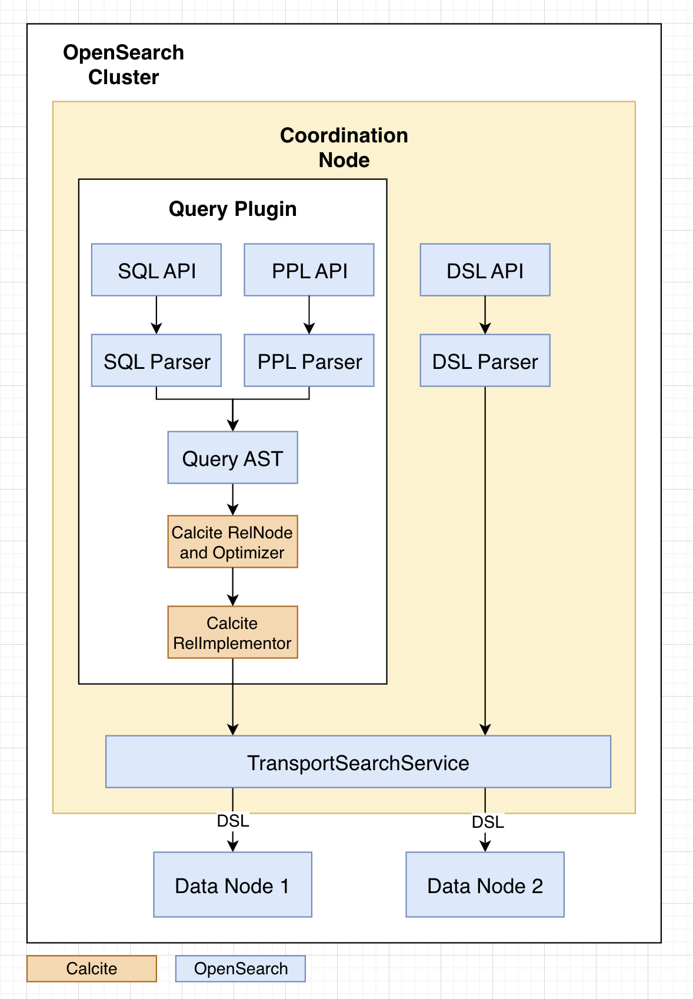
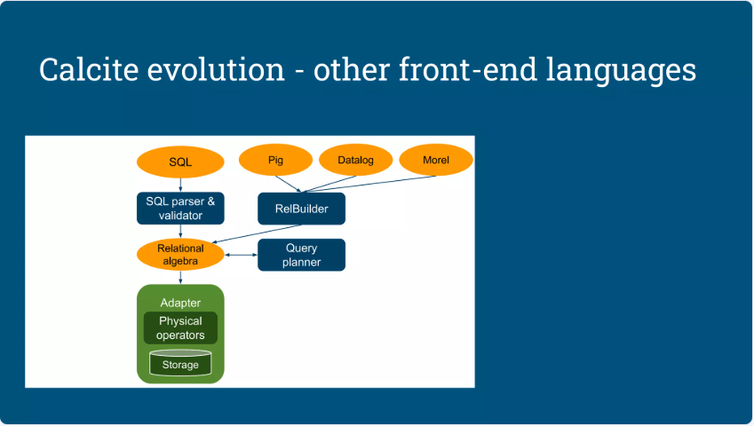
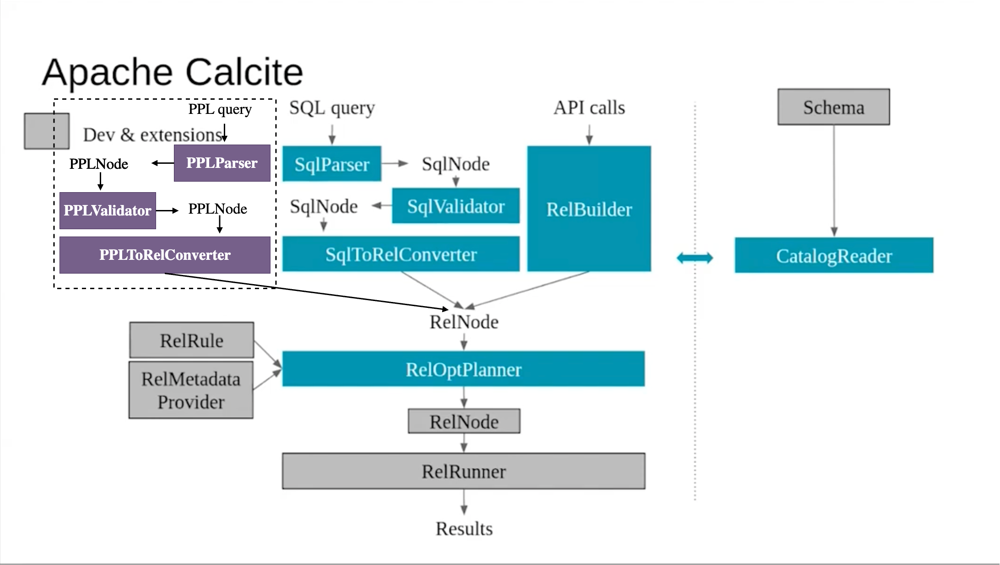

# OpenSearch PPL V3 Engine Architecture

---
## 1. Overview

Apache Calcite (https://calcite.apache.org/) is an open source framework that provides an industry-standard SQL parser, a highly extensible query optimization framework that allows developers to customize and plug in their own rules for improving query performance. It is widely adopted by a variety of organizations and has gained industry support from major players in the data management and analytics space. It is often used as a foundational technology for building custom data management solutions and analytical applications.

Apache Calcite provides

- Parser: parse a SQL statement to an abstract syntax tree (AST)
- Validator: convert AST to logical plan with pluggable catalog
- Optimizer: optimizer the logical plan with rule based optimizer (RBO) or cost based optimizer (CBO).
- Executor: convert optimized plan to Linq expression and execute it via Linq4j connector.
- Translator: translate SQL from one dialect to another.

OpenSearch current support 3 type of query languages DSL, SQL, and PPL. DSL (Domain-Specific Language) is JSON-based and designed to define queries at a lower level (consider it as an executable physical plan). SQL and PPL are implemented in SQL plugin (as v2 engine) and both support support relational operations and concepts such as databases, tables, schemas, and columns. OpenSearch PPL has gradually become the native query language of OpenSearch.

PPL is specifically designed to simplify tasks in observability and security analytics, making it easier for users to analyze and understand their data. Its syntax and concepts align with familiar languages like Splunk SPL and SQL. Although PPL is a native part of OpenSearch, it’s designed independently of any specific query engine, allowing other query engines to adopt it and making it flexible enough to handle structured, semi-structured, and nested data across various platforms.

---
## 2. Pain points

### 2.1. PPL lacks the ability to handle complex queries.
The current PPL engine (shared with SQL v2 engine) is built with custom components, including a parser, analyzer, optimizer, and relies heavily on OpenSearch DSL capabilities to execute query plans. By aligning its syntax and concepts with familiar languages like Splunk SPL and SQL, we aim to streamline migration for users from these backgrounds, allowing them to adopt PPL with minimal effort. The lack of comprehensive ability is a critical blocker for Splunk-to-OpenSearch migrations. We added ~20 new commands in PPL-on-Spark, but there are still dozens of command gaps to be filled. Not to mention that there are still a large number of functions to be implemented.

### 2.2 Lack of Unified PPL Experience
The PPL language is currently inconsistent across [PPL-on-OpenSearch](https://github.com/opensearch-project/sql/blob/main/ppl/src/main/antlr/OpenSearchPPLParser.g4) and [PPL-on-Spark](https://github.com/opensearch-project/opensearch-spark/blob/main/ppl-spark-integration/src/main/antlr4/OpenSearchPPLParser.g4). There are a lot of new commands added in PPL-on-Spark, such as `join`, `lookup` and `subsearch` are not yet supported in PPL-on-OpenSearch. As more and more new commands and functions are implemented in PPL-on-Spark, this gap will continue to widen.

### 2.3 Lack of mature query optimizer
Although the v2 engine framework comes with an optimizer class, it only has a few pushdown optimization rules and lacks of mature optimization rules and cost-based optimizer like those found in traditional databases. Query performance and scalability are core to PPL's design, enabling it to efficiently handle high-performance queries and scale to support large datasets and complex queries.

### 2.4 Lacks the robustness
While PPL has 5,000+ integration tests, it lacks the robustness of more mature systems like SQLite (with over 1 million tests) or PostgreSQL (with 60,000+ tests), impacting both performance and development effort.

---
## 3. High Level View

### 3.1 Proposal
To address above pain points, the V3 engine integrates Apache Calcite as a basic component.

- Apache Calcite is a straightforward and in common use library to help us to solve the **first pain point**. It fully supports the ANSI SQL (even is very complex) and contains many built-in functions of commercial databases.
- The **second pain point** is mainly due to the significant development efforts required to implement a large number of PPL commands for different engines (Spark and OpenSearch). Apache Calcite cannot solve this pain point for short-term, but for long-term, with Apache Calcite, the PPL statements can be translated to various SQL dialects, including SparkSQL, then the current implementation of PPL-on-Spark could be depreciated. the implementation of PPL-on-OpenSearch and PPL-on-Spark can be unified.
- The built-in RBO and CBO optimizers in Apache Calcite, as well as features such as materialized views, can effectively meet and solve the **third pain point**.
- Apache Calcite is widely adopted by a variety of organizations and has gained industry support from major players in the data management and analytics space. Although it does not have the same level of robustness as commercial databases, the Apache Calcite open source community is still active. Absolutely, using existing Apache Calcite code for logical plan optimization and physical operator execution has higher robustness and lower cost than writing code from scratch which solves the **fourth pain point**.

### 3.2 Architecture

The current PPL grammar and existing query AST have widely used (both in PPL-on-OpenSearch and PPL-on-Spark). In addition, the ANTLR4 grammar is used in polyglot validators in fronted and backend (Java validator, J/S validator, Python validator). To keep the ANTLR4 grammar and reuse existing AST, the architecture of integration looks:


---
## 4. Implementation

### 4.1 PPL-on-OpenSearch
```
PPL -> ANTLR -> AST -> RelNode(Calcite) -> EnumerableRel(Calcite) -> OpenSearchEnumerableRel -> OpenSearch API
SQL -> ANTLR -> AST -> RelNode(Calcite) -> EnumerableRel(Calcite)-> OpenSearchEnumerableRel -> OpenSearch API
```

### 4.2 PPL-on-Spark
```
Short-term: PPL -> ANTLR -> AST -> LogicalPlan(Spark) -> PhysicalPlan(Spark) -> tasks (Spark runtime)
Long-term: PPL -> ANTLR -> AST -> RelNode(Calcite) -> SparkSQL API -> tasks (Spark runtime)
```
In this implementation, the main tasks including:

1. Add a PPLParser (ANTLR4 based) to parse PPL statement into existing AST nodes
2. Convert OpenSearch schemas into OpenSearchRelDatatype (partly reuse existing code)
3. Traverse through AST and convert them into RexNodes and RelNodes
4. Map some basic PPL UDFs to Calcite SQL operators
5. Build Calcite UDFs for any other PPL UDFs
6. Have optimizer rules to optimize OpenSearch specific cases and commands.
7. Have all pushdown features working
8. Implement other RelNodes so that PPL can be translated into SparkSQL

### 4.3 RelBuilder

PPL is a non-SQL front-end language, we add a PPL parser and build its AST to relational algebra using `RelBuilder` and execute query against OpenSearch API.

The `RelBuilder` was created for supporting third-part front-end language which are other than SQL. It builds relational algebra and it's fairly straightforward if you want to write a new relational language, you write a parser and generate relational algebra using RelBuilder. And the whole backend Calcite knows executing that's the query against execution system via adaptor.


---
## 5. Appendix

### 5.1 Industry Usage - [Hadoop Pig Latin](https://pig.apache.org/docs/r0.17.0/basic.html)

Pig Latin statements are the basic constructs uses to process data using Apache Pig. A Pig Latin statement is an operator that takes a [relation](https://pig.apache.org/docs/r0.17.0/basic.html#relations) as input and produces another relation as output. Pig Latin statements may include [expressions](https://pig.apache.org/docs/r0.17.0/basic.html#expressions) and [schemas](https://pig.apache.org/docs/r0.17.0/basic.html#schemas).

In Linkedin, they created a internal Calcite repo to convert Pig Latin scripts into Calcite Logical Plan (RelNode), including:

- Use Pig parser to parse Pig Latin scripts into Pig logical plan (AST)
- Convert Pig schemas into RelDatatype
- Traverse through Pig expressions and convert Pig expressions into RexNodes
- Traverse through Pig logical plans to convert each Pig logical nodes to RelNodes
- Map some basic Pig UDFs to Calcite SQL operators
- Build Calcite UDFs for any other Pig UDFs, including UDFs written in both Java and Python
- Have an optimizer rule to optimize Pig group/cogroup into Aggregate operators
- Implement other RelNode in Rel2Sql so that Pig Latin can be translated into SQL

This [work](https://issues.apache.org/jira/browse/CALCITE-3122) had contributed to Apache Calcite and named [Piglet](https://calcite.apache.org/javadocAggregate/org/apache/calcite/piglet/package-summary.html). It allows users to write queries in Pig Latin, and execute them using any applicable Calcite adapter.

Pig Latin leverage `RelBuilder` to implement as a third-part front-end language (dialect).

### 5.2 Other Alternative

Current proposal is reusing existing AST nodes and leveraging `RelBuilder` to implement as a third-part front-end language.
An alternative would be adding a `PPLNode`, similar to `SqlNode` as new AST nodes, and new `PPLValidator` to resolve this new AST with catalog metadata, then creating a `PPLToRelConverter` (similar to `SqlToRelConverter`) for converting `PPLNode`(AST) to `RelNode`(logical plan). See the picture following.


