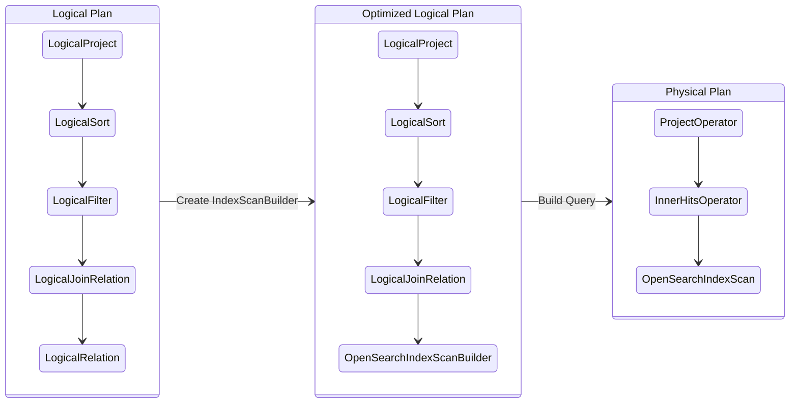
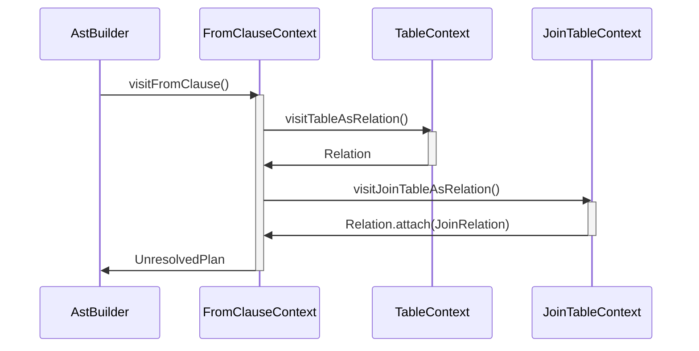
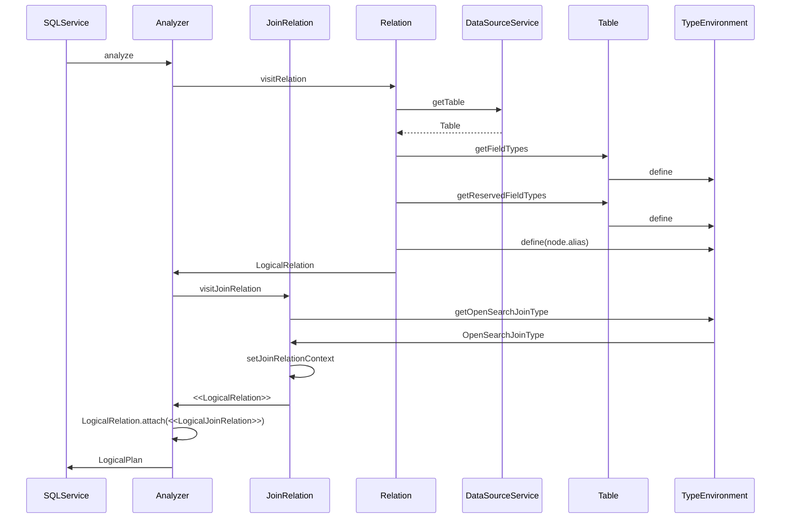
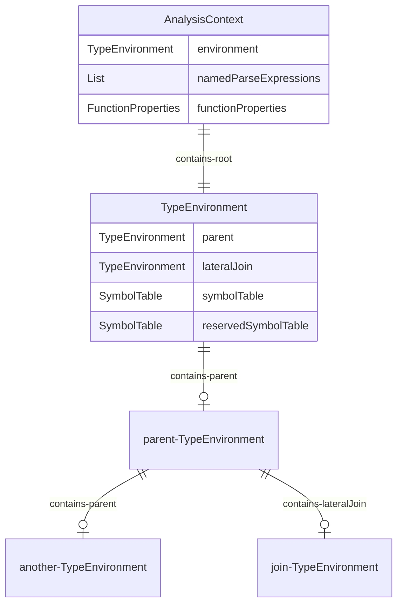
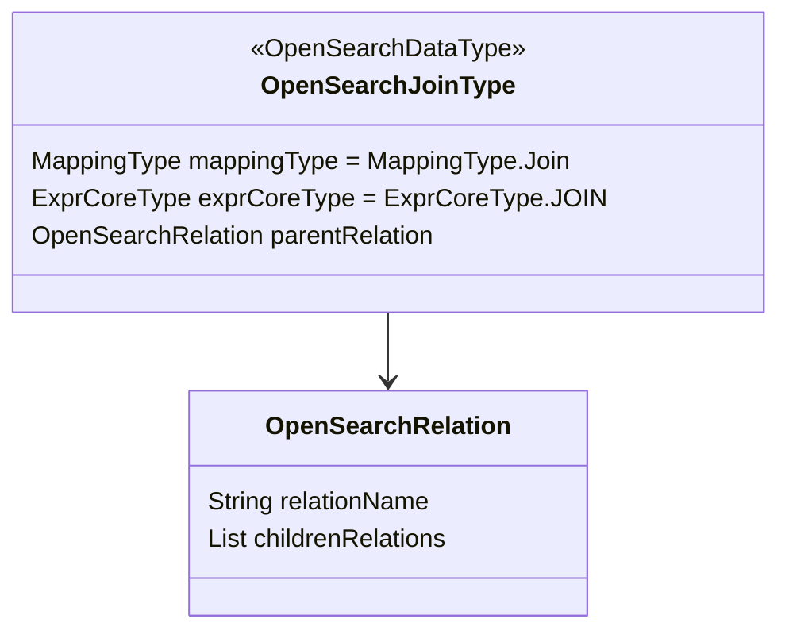
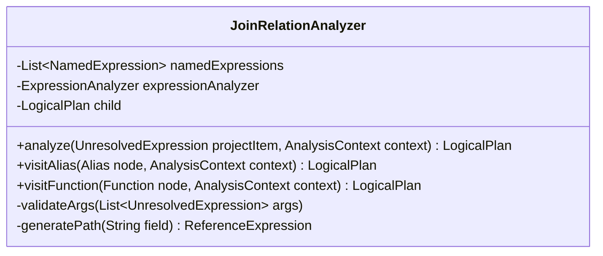
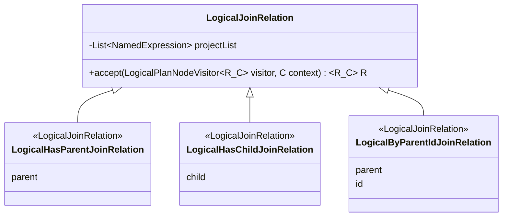
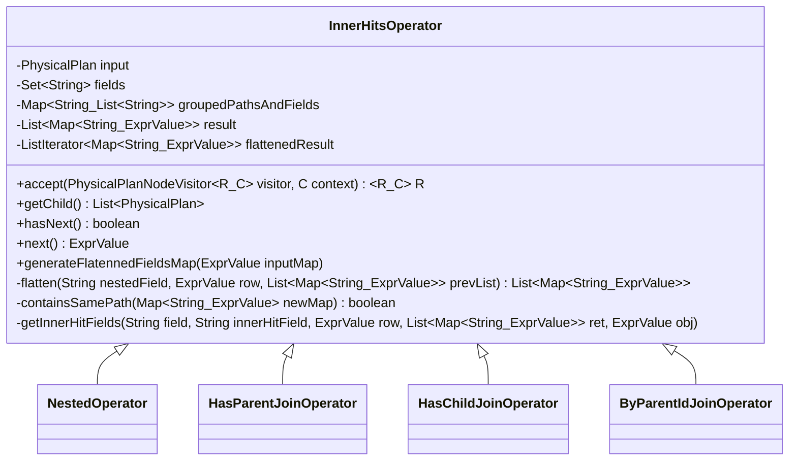

# Overview

The OpenSearch SQL plugin provides a thin-client language-processing engine from SQL to an OpenSeach instance.  The SQL
language is a relational language that provides the JOIN feature to relate tables together by field or expression.  OpenSearch
offers a similar relation mapping within an index, that allows users to relate same-index documents using a parent-child
relation.

This proposal is to outline the limits of a same-table (ie same-index) join relation from SQL grammar, and provide use
cases for same-table JOINs.

# Same-Table Joins Query Design

OpenSearch provides a schema-flexible indexing solution with a 'join' object type (see: [join fields](https://opensearch.org/docs/latest/field-types/join/)) 
that allows users to simulate join relations. There are a couple of restrictions on the join field relations: mainly,
only one relation is allowed per index, and the relations are parent-child relations. 

Joins in a SQL context aim to join relations between two separate tables, and merge them into a single result table. OpenSearch
can do the same relation join within a single index. This proposal provides syntax to join data within a single index
together into a single result set.  

## 1. Motivation

[[FEATURE] Support for subqueries or chaining of queries](https://github.com/opensearch-project/sql/issues/1441) describes
an example use-case where we may want to join logs within a single index that have a common request or application identifier.

## 2. References

* [[FEATURE] Support for subqueries or chaining of queries](https://github.com/opensearch-project/sql/issues/1441)
* [[BUG] implicit join returns wrong results](https://github.com/opensearch-project/sql/issues/683)
* [[FEATURE] Allow individual shards to be targeted during query execution](https://github.com/opensearch-project/sql/issues/1478)
  * [Support for _routing field in SQL queries](https://github.com/opendistro-for-elasticsearch/sql/issues/1151)
* [Nested Design](https://github.com/Bit-Quill/opensearch-project-sql/pull/262)
* [opensearch.org: Join field type](https://opensearch.org/docs/latest/field-types/join/)
* [PariQL](https://partiql.org/)

## 3. Assumptions/Dependencies

* _shard must be defined for any query using a same-table join
* Same-Table joins requires that the following work is complete:
    * Table/Indices can be aliased, for example: `SELECT t.fieldA, t.fieldB FROM table t WHERE t.fieldA = t.fieldB`

### 3.1 Out of Scope

* Fix for implicit JOINs [[BUG] implicit join returns wrong results](https://github.com/opensearch-project/sql/issues/683)
* Fix for _shard or _routing [[FEATURE] Allow individual shards to be targeted during query execution](https://github.com/opensearch-project/sql/issues/1478)
* Performance on the OpenSearch side
* Multiple-shard queries using `join`
* `join` using lateral-table support [PartiQL support in OpenSearch SQL V2](https://github.com/opensearch-project/sql/issues/1104)
* Pagination using `join` or other complex types

### 3.2 Design Decisions

* JOIN-relations architecture is built to work in combination with the `nested` and `object` data types.  This architecture allows
  both same-table joins and nested object (using PartiQL) to share execution paths and syntax.  This shared
  solution can expand support for `lateral` tables and enable `lateral join` and `lateral nested` queries.
    * see [Add support for PArtiQL in V2 engine](https://github.com/opensearch-project/sql/issues/1104)

### 3.3. Storage Type

* `reference to opensearch doc`
* `Describe how to define the JOIN-relation`
* `What the datatype can do`
* `What the datatype cannot do`

## 4. Use Cases

Use Cases with examples for all the ways the join field can be accessed in OpenSearch. Each use case contains examples, 
with data and mappings defined in the Annex.  

### 4.1 Case SELECT... FROM... JOIN ON parent relation

Summary:

Example query (SQL):
```sql
SELECT *
FROM got AS m
JOIN got as h ON (m.house_relation.member = h.house_relation.house)
WHERE h.house.name = "Targaryen"
```

Expected Request to OpenSearch:
```json
{
    "query": {
        "bool": {
            "must": [
                {
                    "has_parent": {
                        "parent_type": "house",
                        "query": {
                            "match": {
                                "house.name": "Targaryen"
                            }
                        }
                    }
                },
                {
                    "term": {
                        "house_relation": "member"
                    }
                }
            ]
        }
    },
    "_source": {
        "includes": [],
        "excludes": []
    }
}
```

Expected Response (OpenSearch-JSON):
```json
{
    "took": 5,
    "timed_out": false,
    "_shards": {
        "total": 1,
        "successful": 1,
        "skipped": 0,
        "failed": 0
    },
    "hits": {
        "total": {
            "value": 1,
            "relation": "eq"
        },
        "max_score": 1.0,
        "hits": [
            {
                "_index": "got-joins",
                "_id": "4",
                "_score": 1.0,
                "_routing": "1",
                "_source": {
                    "house_relation": {
                        "name": "member",
                        "parent": "1"
                    },
                    "name": {
                        "firstname": "Daenerys",
                        "lastname": "Targaryen"
                    },
                    "nickname": "Daenerys \"Stormborn\"",
                    "gender": "F",
                    "parents": {
                        "father": "Aerys",
                        "mother": "Rhaella"
                    },
                    "titles": [
                        {
                            "title": "Mother Of Dragons"
                        },
                        {
                            "title": "Queen Of The Andals"
                        },
                        {
                            "title": "Breaker Of Chains"
                        },
                        {
                            "title": "Khaleesi"
                        }
                    ]
                }
            }
        ]
    }
}
```

### 4.2 Case SELECT... FROM... JOIN USING parent relation

Summary:
The JOIN USING syntax is a shortcut syntax for the ON (relation.parent) syntax, and only works when the relation only contains
a single parent: child relation.  If multiple relations are defined, the USING syntax is ambiguous and a semantic error
needs to throw for the user to correct the syntax.

The results of this example are exactly the same as case 4.1, but only works with a mapping that is simplified.  The following
mapping change is needed from the demo mapping provided in annex A. 

Mapping data:
```json
      "house_relation": {
        "type": "join",
        "relations": {
          "house": "member"
        }
      },
```

Example query (SQL):
```sql
SELECT *
FROM got AS m
JOIN got as h USING house_relation
WHERE h.house.name = "Targaryan"
```

Expected Request to OpenSearch:
```json
{
    "query": {
        "bool": {
            "must": [
                {
                    "has_parent": {
                        "parent_type": "house",
                        "query": {
                            "match": {
                                "house.name": "Targaryen"
                            }
                        }
                    }
                },
                {
                    "term": {
                        "house_relation": "member"
                    }
                }
            ]
        }
    },
    "_source": {
        "includes": [],
        "excludes": []
    }
}
```

Expected Response (OpenSearch-JSON):
```json
{
    "took": 5,
    "timed_out": false,
    "_shards": {
        "total": 1,
        "successful": 1,
        "skipped": 0,
        "failed": 0
    },
    "hits": {
        "total": {
            "value": 1,
            "relation": "eq"
        },
        "max_score": 1.0,
        "hits": [
            {
                "_index": "got-joins",
                "_id": "4",
                "_score": 1.0,
                "_routing": "1",
                "_source": {
                    "house_relation": {
                        "name": "member",
                        "parent": "1"
                    },
                    "name": {
                        "firstname": "Daenerys",
                        "lastname": "Targaryen"
                    },
                    "nickname": "Daenerys \"Stormborn\"",
                    "gender": "F",
                    "parents": {
                        "father": "Aerys",
                        "mother": "Rhaella"
                    },
                    "titles": [
                        {
                            "title": "Mother Of Dragons"
                        },
                        {
                            "title": "Queen Of The Andals"
                        },
                        {
                            "title": "Breaker Of Chains"
                        },
                        {
                            "title": "Khaleesi"
                        }
                    ]
                }
            }
        ]
    }
}
```

### 4.3 Case SELECT... FROM... JOIN ON... WHERE parent relation

Summary: In this case, we are joining from `child` to `parent` using the `has_parent` relation query. 

Example query (SQL):
```sql
SELECT m.name, h.house.name, h.house.words
FROM got AS m
       JOIN got as h ON (m.house_relation.member = h.house_relation.house)
WHERE h.house.name = "Stark"

```

Expected Request to OpenSearch:
```json
{
  "query": {
    "bool": {
      "must": [
        {
          "has_parent": {
            "parent_type": "house",
            "query": {
              "match": {
                "house.name": "Stark"
              }
            },
            "inner_hits": {
              "_source": {
                "includes": [
                  "house.name",
                  "house.words"
                ],
                "excludes": []
              }
            }
          }
        },
        {
          "term": {
            "house_relation": "member"
          }
        }
      ]
    }
  },

  "_source": {
    "includes": [
      "name",
      "house_relation"
    ],
    "excludes": []
  }
}
```

Expected Response (OpenSearch-JSON):
```json
{
  "took": 5,
  "timed_out": false,
  "_shards": {
    "total": 1,
    "successful": 1,
    "skipped": 0,
    "failed": 0
  },
  "hits": {
    "total": {
      "value": 2,
      "relation": "eq"
    },
    "max_score": 2.2685113,
    "hits": [
      {
        "_index": "got-joins",
        "_id": "5",
        "_score": 2.2685113,
        "_routing": "1",
        "_source": {
          "house_relation": {
            "parent": "2",
            "name": "member"
          },
          "name": {
            "firstname": "Eddard",
            "lastname": "Stark"
          }
        },
        "inner_hits": {
          "house": {
            "hits": {
              "total": {
                "value": 1,
                "relation": "eq"
              },
              "max_score": 1.540445,
              "hits": [
                {
                  "_index": "got-joins",
                  "_id": "2",
                  "_score": 1.540445,
                  "_routing": "1",
                  "_source": {
                    "house": {
                      "name": "Stark",
                      "words": "Winter Is Coming"
                    }
                  }
                }
              ]
            }
          }
        }
      },
      {
        "_index": "got-joins",
        "_id": "6",
        "_score": 2.2685113,
        "_routing": "1",
        "_source": {
          "house_relation": {
            "parent": "2",
            "name": "member"
          },
          "name": {
            "firstname": "Brandon",
            "lastname": "Stark"
          }
        },
        "inner_hits": {
          "house": {
            "hits": {
              "total": {
                "value": 1,
                "relation": "eq"
              },
              "max_score": 1.540445,
              "hits": [
                {
                  "_index": "got-joins",
                  "_id": "2",
                  "_score": 1.540445,
                  "_routing": "1",
                  "_source": {
                    "house": {
                      "name": "Stark",
                      "words": "Winter Is Coming"
                    }
                  }
                }
              ]
            }
          }
        }
      }
    ]
  }
}
```

### 4.4 Case SELECT... FROM... JOIN... WHERE on child relation

Summary: In this case, we are joining from `parent` to `child` using the `has_child` relation query.

Example query (SQL):
```sql
SELECT m.name, h.housename, h.words
FROM got AS h
JOIN got as m ON (m.house_relation.member = h.house_relation.house)
WHERE nested(m.titles, m.titles.title = "Kingslayer"))

```

Expected Request to OpenSearch:
```json
{
    "query": {
        "bool": {
            "must": [
                {
                    "has_child": {
                        "type": "member",
                        "query": {
                            "nested": {
                                "path": "titles",
                                "query": {
                                    "bool": {
                                        "must": {
                                            "match": {
                                                "titles.title": "Kingslayer"
                                            }
                                        }
                                    }
                                }
                            }
                        },
                        "inner_hits": {
                            "_source": {
                                "includes": [
                                    "name"
                                ],
                                "excludes": []
                            }
                        }
                    }
                },
                {
                    "term": {
                        "house_relation": "house"
                    }
                }
            ]
        }
    },
    "_source": {
        "includes": [
            "house"
        ],
        "excludes": []
    }
}
```

Expected Response (OpenSearch-JSON):
```json
{
    "took": 5,
    "timed_out": false,
    "_shards": {
        "total": 1,
        "successful": 1,
        "skipped": 0,
        "failed": 0
    },
    "hits": {
        "total": {
            "value": 1,
            "relation": "eq"
        },
        "max_score": 1.0,
        "hits": [
            {
                "_index": "got-joins",
                "_id": "3",
                "_score": 1.0,
                "_routing": "1",
                "_source": {
                    "house": {
                        "seat": "Casterly Rock",
                        "sigil": "Lion",
                        "name": "Lannister",
                        "words": "Hear Me Roar"
                    }
                },
                "inner_hits": {
                    "member": {
                        "hits": {
                            "total": {
                                "value": 1,
                                "relation": "eq"
                            },
                            "max_score": 2.4849067,
                            "hits": [
                                {
                                    "_index": "got-joins",
                                    "_id": "7",
                                    "_score": 2.4849067,
                                    "_routing": "1",
                                    "_source": {
                                        "name": {
                                            "firstname": "Jaime",
                                            "lastname": "Lannister"
                                        }
                                    }
                                }
                            ]
                        }
                    }
                }
            }
        ]
    }
}
```

### 4.6 Case SELECT... FROM... JOIN ON (parent _id)

Summary: In this case, we are joining from `child` to `parent` on a specific `_id` using the `parent_id` relation query.
This finds a specific document id as the parent.  

Example query (SQL):
```sql
SELECT vh.house, vh.house_relation.name
FROM got AS vh
JOIN got as h ON (h._id = "3")
```

Expected Request to OpenSearch:
```json
{
    "query": {
        "parent_id": {
            "type": "vassel_house",
            "id": "3"
        }
    },
    "_source": {
        "includes": [
            "house",
            "house_relation.name"
        ],
        "excludes": []
    }
}
```

Expected Response (OpenSearch-JSON):
```json
{
    "took": 3,
    "timed_out": false,
    "_shards": {
        "total": 1,
        "successful": 1,
        "skipped": 0,
        "failed": 0
    },
    "hits": {
        "total": {
            "value": 1,
            "relation": "eq"
        },
        "max_score": 1.3121864,
        "hits": [
            {
                "_index": "got-joins",
                "_id": "12",
                "_score": 1.3121864,
                "_routing": "1",
                "_source": {
                    "house_relation": {
                        "name": "vassel_house"
                    },
                    "house": {
                        "seat": "Crakehall",
                        "sigil": "Brindled Boar",
                        "name": "Crakehall",
                        "words": "None So Fierce"
                    }
                }
            }
        ]
    }
}
```


### 4.7 Case JOIN on multiple children

Summary: In this case, we have multiple children of `house` (children are `member`, `retainer` and `vassel_house`), and
we are joining the `house` table with each of these children. 

Note, the Mapping file in the Annex contains:
```json
{
  "mappings": {
    "properties": {
      "house_relation": {
        "type": "join",
        "relations": {
          "house": [
            "member",
            "retainer",
            "vassel_house"
          ],
          "vassel_house": "vassel"
        }
      }
    }
  }
}
```

Example query (SQL):
```sql
SELECT m_or_r_or_vh.name, m_or_r_or_vh.house
FROM got AS m_or_r_or_vh
JOIN got as h ON (m_or_r_or_vh.house_relation.member = h.house_relation.house
               OR m_or_r_or_vh.house_relation.retainer = h.house_relation.house
               OR m_or_r_or_vh.house_relation.vassel_house = h.house_relation.house
  )
WHERE h.house.name = "Targaryen"
```

Expected Request to OpenSearch:
```json
{
  "query": {
    "bool": {
      "must": [
        {
          "has_parent": {
            "parent_type": "house",
            "query": {
              "match": {
                "house.name": "Stark"
              }
            }
          }
        }
      ],
      "should": [
        {
          "term": {
            "house_relation": "member"
          }
        },
        {
          "term": {
            "house_relation": "retainer"
          }
        },
        {
          "term": {
            "house_relation": "vassel_house"
          }
        }
      ],
      "minimum_should_match" : 1
    }
  },

  "_source": {
    "includes": [
      "name",
      "house"
    ],
    "excludes": []
  }
}
```

### 4.8 Case JOIN ON Children and Grandchildren

Summary: In this case, we have a child of a child of the `house`. Child is `vassel_house`, and the child of `vassel_house`
is `vassel`. We are doing two joins from table to table to table. 

Example query (SQL):
```sql
SELECT v.name, h.house.name, h.house.words
FROM got AS v
JOIN got as vh ON (v.house_relation.vassel = vh.house_relation.vassel_house)
JOIN got as h ON (vh.house_relation.vassel_house = h.house_relation.house)
WHERE h.house.name = "Start"
```

Expected Request to OpenSearch:
```json
{
    "query": {
        "bool": {
            "must": [
                {
                    "has_parent": {
                        "parent_type": "vassel_house",
                        "query": {
                            "bool": {
                                "must": [
                                    {
                                        "has_parent": {
                                            "parent_type": "house",
                                            "query": {
                                                "match": {
                                                    "house.name": "Stark"
                                                }
                                            }
                                        }
                                    },
                                    {
                                        "term": {
                                            "house_relation": "vassel_house"
                                        }
                                    }
                                ]
                            }
                        }
                    }
                },
                {
                    "term": {
                        "house_relation": "vassel"
                    }
                }
            ]
        }
    },
    
    "_source": {
        "includes": [
            "name"
        ],
        "excludes": []
    }
}
```

Expected Response (OpenSearch-JSON):
```json
{
    "took": 5,
    "timed_out": false,
    "_shards": {
        "total": 1,
        "successful": 1,
        "skipped": 0,
        "failed": 0
    },
    "hits": {
        "total": {
            "value": 2,
            "relation": "eq"
        },
        "max_score": 2.5198257,
        "hits": [
            {
                "_index": "got-joins",
                "_id": "14",
                "_score": 2.5198257,
                "_routing": "1",
                "_source": {
                    "name": {
                        "firstname": "Roose",
                        "lastname": "Bolton"
                    }
                }
            },
            {
                "_index": "got-joins",
                "_id": "15",
                "_score": 2.5198257,
                "_routing": "1",
                "_source": {
                    "name": {
                        "firstname": "Ramsey",
                        "lastname": "Bolton"
                    }
                }
            }
        ]
    }
}
```

## 5. Functional Requirements


| Feature                                                                | Priority     | Phase |
|------------------------------------------------------------------------|--------------|-------|
| Table alias                                                            | dependency   | *     |
| [Implicit joins](https://github.com/opensearch-project/sql/issues/683) | dependency   | *     |
| Including routing_id API option                                        | must have    | *     |
| Update datatype to accept joins type                                   | must have    | P0    |
| Check for semantic errors on mapping                                   | must have    | P0    |
| Add parser support for JOIN...USING...                                 | must have    | P0    |
| Allow for parent-child joins                                           | must have    | P0    |
| Allow for child-parent joins                                           | must have    | P0    |
| Retrieve inner_hits                                                    | must have    | P0    |
| Allow for parent_id joins                                              | nice to have | P1    |
| Aggregation on children                                                | nice to have | P2    |
| Sorting on children                                                    | nice to have | P2    |
| Documentation for same-table Joins                                     | must have    | P0    |

_Phase `*`_ denotes dependencies that must be completed prior to starting this work.

### 5.1 Release Schedule

| Release                                                                     | Dependency   | Effort |
|-----------------------------------------------------------------------------|--------------|-------|
| Phase 0 - containing basic support for parent-child mapping<br/>Allows for  | must have    | P0    |
| Check for semantic errors on mapping                                        | must have    | P0    |
| Including routing_id API option                                             | must have    | P0    |
| Add parser support for JOIN...USING...                                      | must have    | P0    |
| Allow for parent-child joins                                                | must have    | P0    |
| Allow for child-parent joins                                                | must have    | P0    |
| Retrieve inner_hits                                                         | must have    | P0    |
| Allow for parent_id joins                                                   | nice to have | P1    |
| Aggregation on children                                                     | nice to have | P1    |
| Sorting on children                                                         | nice to have | P1    |
| Documentation for same-table Joins                                          | must have    | P0    |

## 6. High-Level Design

### 6.1 Parser Syntax

```antlrv4
fromClause
    : FROM relation
      (joinClause)? // for same-table joins and lateral joins  
      (whereClause)?
      (groupByClause)?
      (havingClause)?
      (orderByClause)? // Place it under FROM for now but actually not necessary ex. A UNION B ORDER BY
    ;

relation
    : tableName (AS? alias)?                                                #tableAsRelation
    | LR_BRACKET subquery=querySpecification RR_BRACKET AS? alias           #subqueryAsRelation
    ;

joinClause
    // | (INNER | CROSS)? JOIN LATERAL? tableName (AS? alias)?
    : JOIN tableName (AS? alias)?
        (
            ON expression
          | USING LR_BRACKET expression RR_BRACKET
        )?                                                                  #innerJoin
    // | STRAIGHT_JOIN tableSourceItem (ON expression)?                #straightJoin
    // | (LEFT | RIGHT) OUTER? JOIN LATERAL? tableSourceItem
    //     (
    //       ON expression
    //       | USING '(' uidList ')'
    //     )                                                           #outerJoin
    // | NATURAL ((LEFT | RIGHT) OUTER?)? JOIN tableSourceItem         #naturalJoin
    ;
```

The above grammar contains commented out grammar that may be useful for future JOIN work, and was copied from the ANSI-SQL-92
documentation.  For example, the `JOIN LATERAL ON | USING` grammar may be useful for lateral joins that will be discussed
briefly in the document below.

The above grammar supports the following use-cases:

#### 6.1.1. Same-table JOIN using the `has_parent` relation:
```sql
FROM table AS tableAlias
JOIN table AS joinTableAlias USING (relation.parent)
```
Where `relation` is the data field mapped as a `join` type, with parent:child, and we want to join on the parent documents
in the relation. Note: if the relation is ambiguous (because more than one relationship is defined for the `parent`), this
syntax will report an error.

#### 6.1.2. Same-table JOIN using the `has_child` relation:
```sql
FROM table AS tableAlias
JOIN table AS joinTableAlias USING (relation.child)
```
Where `relation` is the data field mapped as a `join` type, with `parent:child`, and we want to join on the children documents
in the relation. Note: if the relation is ambiguous (because more than one relationship is defined for the `child`), this
syntax will report an error.

#### 6.1.3. Same-table JOIN using either `has_parnet` or `has_child` relation:
```sql
FROM table AS tableAlias
JOIN table AS joinTableAlias ON (joinTableAlias.relation.parent = tableAlias.relation.child)
```
Where `relation` is the data field mapped as a `join` type, with `parent:child`, and we want to join on parent documents using
the index scan `tableAlias` abd child documents using the index scan `joinTableAlias`.  Note: this syntax is more explicit
that the above syntax and can be used when there are multiple relations defined in the index mapping.

#### 6.1.4. Same-table JOIN using `parent_id` relation:
```sql
FROM table AS tableAlias
JOIN table AS joinTableAlias ON (joinTableAlias.relation.parent = 'myId')
```
Where `relation` is the data field mapped as a `join` type, and we want to join on the parent documents with `_id` equal
to the string `myId`.

### 6.2 Presentations

The following diagram explains the proposed sequence to create JOIN request to OpenSearch

#### 6.2.1 Logical Plan Changes

The following diagram shows the placement of the `LogicalJoinRelation` as part of the Logical Plan, and the `InnerHitsOperator` 
(name is pending) as part of the physical plan. 



#### 6.2.2 Parse Tree Changes

We need to accept JOIN grammar, including `JOIN USING` and `JOIN ON` syntax in the `FROM` clause.  The following diagram
show how the ASTBuilder constructs the `LogicalRelation` object (containing a `Table` or `OpenSearchIndex` object) from 
the Relation clause, which is similar to how the `LogicalJoinRelation` object is constructed from the JoinRelation clause.   



#### 6.2.3 Logical Plan Relation Visitor

The following sequence diagram shows how the join type is processed from logical to physical plan. 



## 7. Detailed-Design Architecture

The LogicalPlan will contain an extra Node called the LogicalJoinRelation, which stores the context
on how the table is self-joined.  We may need to define specific 'types' based on the type
of relationship: parent-child, child-parent, or parent_id.  We will need access to the join datatype
and need to create an `OpenSearchDataType` for joins.

### 7.1 Presentation

ER diagram for how AnalyzerContext contains the TypeEnvironment(s).  The TypeEnvironment defined the 
types (indices and symbols) for each relation environment.  There may be multiple
relations, in the case of joins.  A lateral join will be on the same index or relation, but
the symbol table will be different (through aliasing or otherwise).

The lateralJoin field is new, and will create a separate LogicalJoin node in the Logical Plan. 



The 'Join' type is defined by OpenSearch, and contains the `relation` field
that holds the various parent-child relations.  Note that there can only be 
a single parent, but the parent can have child, or even grand-child relations. 



The `JoinRelationAnalyzer` creates the `LogicalJoinRelation` from the `Relation` AST nodes. 
There may be more than one `LogicalJoinRelation` created, but they will always
exist as parents to the `LogicalRelation`. 



The LogicalJoinRelation will be of one of 3 types, depending on how the relation is queried
in OpenSearch.  It will use either the `has_parent`, `has_child`, or `parent_id` 
relation queries.  Regardless, these 



The `LogicalJoinRelation` transforms into a `JoinOperator` during the logical-to-physical plan.
The `JoinOperator` takes the form of an `InnerHitsOperator`, as the inner_hits for each join 
relation need to be considered and flattened into the result hits.  This is the same operation 
as the current `NestedOperator`.  The flattening algorithm can be refactored out of the `NestedOperator`
and re-purposed into the `InnerHitsOperator`. 



# Annex

## Annex A - Data Mapping for examples

The following section includes data-mapping for data in Annex B that can be PUT into OpenSearch as an index mapping.

```json
{
  "mappings": {
    "properties": {
      "house_relation": {
        "type": "join",
        "relations": {
          "house": ["member", "retainer", "vassel_house"],
          "vassel_house": "vassel"
        }
      },
      "nickname": {
        "type": "keyword"
      },
      "name": {
        "properties": {
          "firstname": {
            "type": "text",
            "fielddata": true
          },
          "lastname": {
            "type": "text",
            "fielddata": true
          }
        }
      },
      "gender": {
        "type": "text",
        "fields": {
          "keyword": {
            "type": "keyword"
          }
        }
      },
      "parents": {
        "properties": {
          "father": {
            "type": "keyword"
          },
          "mother": {
            "type": "keyword"
          }
        }
      },
      "titles": {
        "type": "nested",
        "properties": {
          "title": {
            "type": "keyword"
          }
        }
      },
      "words": {
        "type": "text",
        "fielddata": true
      },
      "house": {
        "properties": {
          "name": {
            "type": "keyword"
          },
          "sigil": {
            "type": "keyword"
          },
          "seat": {
            "type": "keyword"
          }
        }
      }
    }
  }
}
```

## Annex B - Data for examples

The following section includes data that has been formatted to be used by the OpenSearch `got/_bulk` ingest endpoint.

Houses:
```json
{"index":{"_id":"1"}}
{"house_relation": {"name":"house"},"house":{"name":"Targaryen","words":"Fire And Blood","sigil":"Dragon","seat":"Dragonstone"}}
{"index":{"_id":"2"}}
{"house_relation": {"name":"house"},"house":{"name":"Stark","words":"Winter Is Coming","sigil":"Direwolf","seat":"Winterfell"}}
{"index":{"_id":"3"}}
{"house_relation": {"name":"house"},"house":{"name":"Lannister","words":"Hear Me Roar","sigil":"Lion","seat":"Casterly Rock"}}

```

Members:
```json
{"index":{"_id":"4"}}
{"house_relation":{"name":"member","parent":"1"},"name":{"firstname":"Daenerys","lastname":"Targaryen"},"nickname":"Daenerys \"Stormborn\"","gender":"F","parents":{"father":"Aerys","mother":"Rhaella"},"titles":[{"title":"Mother Of Dragons"},{"title":"Queen Of The Andals"},{"title":"Breaker Of Chains"},{"title":"Khaleesi"}]}
{"index":{"_id":"5"}}
{"house_relation":{"name":"member","parent":"2"},"name":{"firstname":"Eddard","lastname":"Stark"},"parents":{"father":"Rickard" , "mother":"Lyarra"} ,"gender":"M","titles":[{"title":"Lord Of Winterfell"},{"title":"Warden Of The North"},{"title":"Hand Of The King"}]}
{"index":{"_id":"6"}}
{"house_relation":{"name":"member","parent":"2"},"name":{"firstname":"Brandon","lastname":"Stark"},"parents":{"father":"Eddard","mother":"Catelyn"},"gender":"M","titles":{"title":"Prince Of Winterfell"}}
{"index":{"_id":"7"}}
{"house_relation":{"name":"member","parent":"3"},"name":{"firstname":"Jaime","lastname":"Lannister"},"gender":"M","parents":{"father":"Tywin","mother":"Joanna"},"titles":[{"title":"Kingslayer"},{"title":"Lord Commander Of The Kingsguard"},{"title":"Ser"}]}

```

Vassel Houses:
```json
{"index":{"_id":"10"}}
{"house_relation": {"name":"vassel_house","parent":"2"},"house":{"name":"Bolton","words":"Our Blades Are Sharp","sigil":"Flayed Man","seat":"Dreadfort"}}
{"index":{"_id":"11"}}
{"house_relation": {"name":"vassel_house","parent":"2"},"house":{"name":"Mormont","words":"Here We Stand","sigil":"Black Bear","seat":"Bear Island"}}
{"index":{"_id":"12"}}
{"house_relation": {"name":"vassel_house","parent":"3"},"house":{"name":"Crakehall","words":"None So Fierce","sigil":"Brindled Boar","seat":"Crakehall"}}

```

Vassels:
```json
{"index":{"_id":"13"}}
{"house_relation":{"name":"vassel","parent":"12"},"name":{"firstname":"Desmond","lastname":"Crakehall"},"gender":"M","titles":{"title":"Lord of Crakehall"}}
{"index":{"_id":"14"}}
{"house_relation":{"name":"vassel","parent":"10"},"name":{"firstname":"Roose","lastname":"Bolton"},"gender":"M","titles":{"title":"Lord of the Dreadfort"}}
{"index":{"_id":"15"}}
{"house_relation":{"name":"vassel","parent":"10"},"name":{"firstname":"Ramsey","lastname":"Bolton"},"gender":"M"}

```

Retainers:
```json
{"index":{"_id":"8"}}
{"house_relation":{"name":"retainer","parent":"2"},"name":{"firstname":"Luwin"},"nickname":"Maester Luwin","gender":"M","titles":{"title":"Maester"}}
{"index":{"_id":"9"}}
{"house_relation":{"name":"retainer","parent":"2"},"name":{"firstname":"Rodrik","lastname":"Cassel"},"nickname":"Maester Luwin","gender":"M","titles":[{"title":"Ser"},{"title":"Master-At-Arms at Winterfell"},{"title":"Castellan of Winterfell"}]}

```