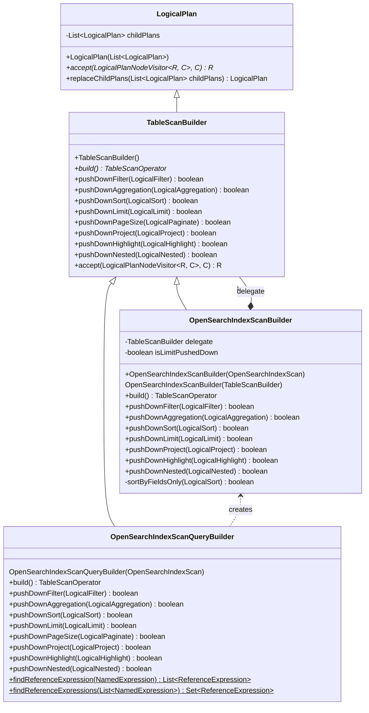
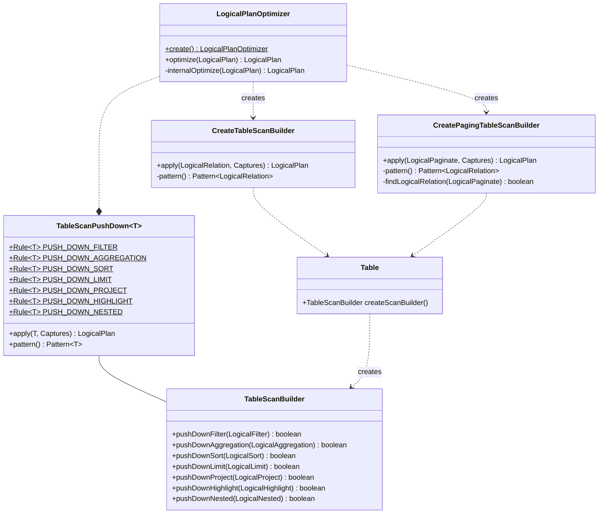

### Background

This section introduces the current architecture of logical optimizer and physical transformation.

#### Logical-to-Logical Optimization

Currently each storage engine adds its own logical operator as concrete implementation for `TableScanOperator` abstraction. Typically each data source needs to add 2 logical operators for table scan with without aggregation. Take OpenSearch for example, there are `OpenSearchLogicalIndexScan` and `OpenSearchLogicalIndexAgg` and a bunch of pushdown optimization rules for each accordingly.

```py
class LogicalPlanOptimizer:
  /*
   * OpenSearch rules include:
   *   MergeFilterAndRelation
   *   MergeAggAndIndexScan
   *   MergeAggAndRelation
   *   MergeSortAndRelation
   *   MergeSortAndIndexScan
   *   MergeSortAndIndexAgg
   *   MergeSortAndIndexScan
   *   MergeLimitAndRelation
   *   MergeLimitAndIndexScan
   *   PushProjectAndRelation
   *   PushProjectAndIndexScan
   *
   * that return *OpenSearchLogicalIndexAgg*
   *  or *OpenSearchLogicalIndexScan* finally
   */
  val rules: List<Rule>

  def optimize(plan: LogicalPlan):
    for rule in rules:
      if rule.match(plan):
        plan = rules.apply(plan)
    return plan.children().forEach(this::optimize)
```

#### Logical-to-Physical Transformation

After logical transformation, planner will let the `Table` in `LogicalRelation` (identified before logical transformation above) transform the logical plan to physical plan.

```py
class OpenSearchIndex:

  def implement(plan: LogicalPlan):
    return plan.accept(
      DefaultImplementor():
        def visitNode(node):
          if node is OpenSearchLogicalIndexScan:
            return OpenSearchIndexScan(...)
          else if node is OpenSearchLogicalIndexAgg:
            return OpenSearchIndexScan(...)
```

### Problem Statement

The current planning architecture causes 2 serious problems:

1. Each data source adds special logical operator and explode the optimizer rule space. For example, Prometheus also has `PrometheusLogicalMetricAgg` and `PrometheusLogicalMetricScan` accordingly. They have the exactly same pattern to match query plan tree as OpenSearch.
2. A bigger problem is the difficulty of transforming from logical to physical when there are 2 `Table`s in query plan. Because only 1 of them has the chance to do the `implement()`. This is a blocker for supporting `INSERT ... SELECT ...` statement or JOIN query. See code below.

```java
  public PhysicalPlan plan(LogicalPlan plan) {
    Table table = findTable(plan);
    if (table == null) {
      return plan.accept(new DefaultImplementor<>(), null);
    }
    return table.implement(
        table.optimize(optimize(plan)));
  }
```

### Solution

#### TableScanBuilder

A new abstraction `TableScanBuilder` is added as a transition operator during logical planning and optimization. Each data source provides its implementation class by `Table` interface. The push down difference in non-aggregate and aggregate query is hidden inside specific scan builder, for example `OpenSearchIndexScanBuilder` rather than exposed to core module.



#### Table Push Down Rules

In this way, `LogicalPlanOptimizer` in core module always have the same set of rule for all push down optimization.



### Examples

The following diagram illustrates how `TableScanBuilder` along with `TablePushDownRule` solve the problem aforementioned.


Similarly, `TableWriteBuilder` will be added and work in the same way in separate PR: https://github.com/opensearch-project/sql/pull/1094


### TODO

1. Refactor Prometheus optimize rule and enforce table scan builder
2. Figure out how to implement AD commands
4. Deprecate `optimize()` and `implement()` if item 1 and 2 complete
5. Introduce fixed point or maximum iteration limit for iterative optimization
6. Investigate if CBO should be part of current optimizer or distributed planner in future
7. Remove `pushdownHighlight` once it's moved to OpenSearch storage
8. Move `TableScanOperator` to the new `read` package (leave it in this PR to avoid even more file changed)
