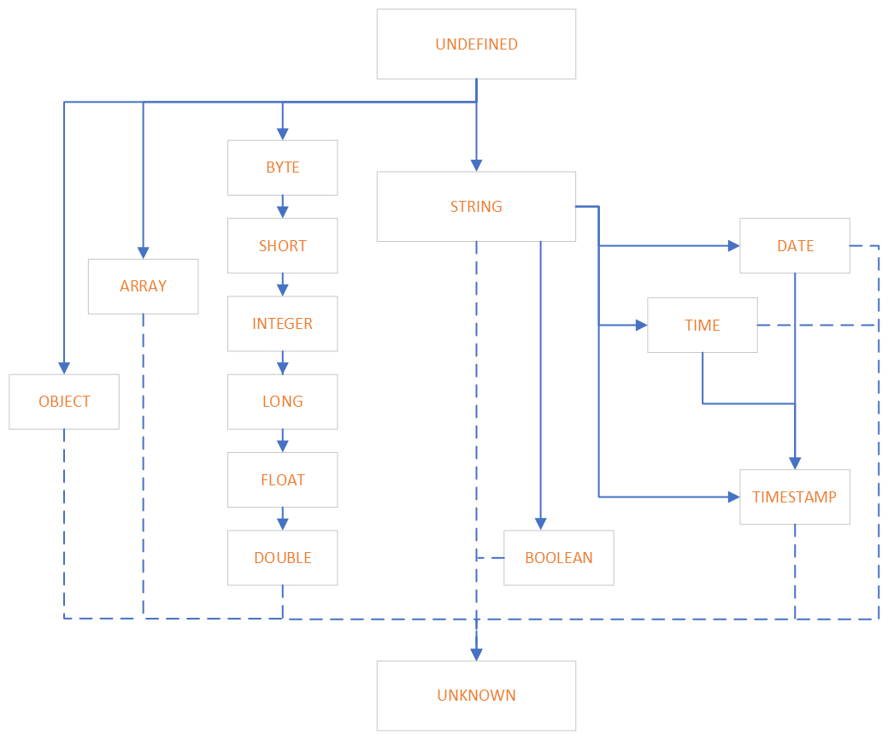

# Data Type Conversion in SQL/PPL

## 1.Overview

### 1.1 Type Conversion

Type conversion means conversion from one data type to another which has two aspects to consider:

1. Whether the conversion is implicit or explicit (implicit conversion is often called coercion)
2. Whether the data is converted within the family or reinterpreted as another data type outside

It's common that strong typed language only supports little implicit conversions and no data reinterpretation. While languages with weak typing allows many implicit conversions and flexible reinterpretation.

### 1.2 Problem Statement

Currently, there are only 2 implicit conversions allowed which are defined by type hierarchy tree:

1. Numeric type coercion: narrower numeric types are closer to the root on the top. For example, an integer is converted to a long integer automatically similar as in JAVA.
2. NULL literals: `UNDEFINED` type can be converted to any other so that NULL literal can be accepted by any expression at runtime.


However, more general conversions for non-numeric types are missing, such as conversions between string, bool and date types. The strict type check causes inconvenience and other problems discussed below.


---
## 2.Requirements

### 2.1 Use Cases

The common use case and motivation include:

1. *User-friendly*: Although it doesn't matter for application or BI tool which can always follow the strict grammar rule, it's more friendly and accessible to human by implicit type conversion, ex. `date > DATE('2020-06-01') => date > '2020-06-01'`
2. *Schema-on-read*: More importantly, implicit conversion from string is required for schema on read (stored as raw string on write and extract field(s) on read), ex. `regex '...' | abs(a)`

### 2.2 Functionalities

Immediate:

1. Implicit conversion between bool and string: https://github.com/opendistro-for-elasticsearch/sql/issues/1061
2. Implicit conversion between date and string: https://github.com/opendistro-for-elasticsearch/sql/issues/1056

Future:

1. Implicit conversion between string and more other types for regex command support


---
## 3.Design

### 3.1 Type Precedence

Type precedence determines the direction of conversion when fields involved in an expression has different type from resolved signature. Before introducing it into our type system, let's check how an expression is resolved to a function implementation and why type precedence is required.

```
Compiling time:
 Expression: 1 = 1.0
 Unresolved signature: equal(INT, DOUBLE)
 Resovled signature: equal(DOUBLE, DOUBLE) , distance=1
 Function builder: returns equal(DOUBLE, DOUBLE) impl
```

Now let's follow the same idea to add support for conversion from `BOOLEAN` to `STRING`. Because all boolean values can be converted to a string (in other word string is 'wider'), String type is made the parent of Boolean. However, this leads to wrong semantic as the following expression `false = 'FALSE'` for example:

```
Compiling time:
 Expression: false = 'FALSE'
 Unresolved signature: equal(BOOL, STRING)
 Resovled signature: equal(STRING, STRING)
 Function builder: returns equal(STRING, STRING) impl

Runtime:
 Function impl: String.value(false).equals('FALSE')
 Evaluation result: *false*
```

Therefore type precedence is supposed to be defined based on semantic expected rather than intuitive 'width' of type. Now let's reverse the direction and make Boolean the parent of String type.


Note: type hierarchy structure shown on the picture below was implemented in [#166](https://github.com/opensearch-project/sql/pull/166), but was changed later.

```
Compiling time:
 Expression: false = 'FALSE'
 Unresolved signature: equal(BOOL, STRING)
 Resovled signature: equal(BOOL, BOOL)
 Function builder: 1) returns equal(BOOL, cast_to_bool(STRING)) impl
                   2) returns equal(BOOL, BOOL) impl
Runtime:
 equal impl: false.equals(cast_to_bool('FALSE'))
 cast_to_bool impl: Boolean.valueOf('FALSE')
 Evaluation result: *true*
```

### 3.2 General Rules

1. Implicit conversion is defined by type precedence which is represented by the type hierarchy tree.
2. Explicit conversion defines the complete set of conversion allowed. If no explicit conversion defined, implicit conversion should be impossible too.
3. On the other hand, if implicit conversion can occur between 2 types, then explicit conversion should be allowed too.
4. Conversion within a data type family is considered as conversion between different data representation and should be supported as much as possible.
5. Conversion across 2 data type families is considered as data reinterpretation and should be enabled with strong motivation.

---
## 4.Implementation

### 4.1 Explicit Conversion

Explicit conversion is defined as the set of `CAST` function implementation which includes all the conversions allowed between data types. Same as before, missing cast function is added and implemented by the conversion logic in `ExprType` class.

```java
public class Cast extends UnresolvedExpression {

  private static final Map<String, FunctionName> CONVERTED_TYPE_FUNCTION_NAME_MAP =
      new ImmutableMap.Builder<String, FunctionName>()
          .put("string", CAST_TO_STRING.getName())
          .put("byte", CAST_TO_BYTE.getName())
          .put("short", CAST_TO_SHORT.getName())
          .put("int", CAST_TO_INT.getName())
          .put("integer", CAST_TO_INT.getName())
          .put("long", CAST_TO_LONG.getName())
          .put("float", CAST_TO_FLOAT.getName())
          .put("double", CAST_TO_DOUBLE.getName())
          .put("boolean", CAST_TO_BOOLEAN.getName())
          .put("date", CAST_TO_DATE.getName())
          .put("time", CAST_TO_TIME.getName())
          .put("timestamp", CAST_TO_TIMESTAMP.getName())
          .build();
}
```

### 4.2 Implicit Conversion

Implicit conversion and precedence are defined by the type hierarchy tree. The data type at the head of an arrow has higher precedence than the type at the tail.

```java
public enum ExprCoreType implements ExprType {
  UNKNOWN,
  UNDEFINED,

  /**
   * Numbers.
   */
  BYTE(UNDEFINED),
  SHORT(BYTE),
  INTEGER(SHORT),
  LONG(INTEGER),
  FLOAT(LONG),
  DOUBLE(FLOAT),

  STRING(UNDEFINED),
  BOOLEAN(STRING), // #166 changes: STRING's parent to BOOLEAN

  /**
   * Date.
   */
  DATE(STRING),  // #171 changes: datetime types parent to STRING
  TIME(STRING),
  DATETIME(STRING, DATE, TIME), // #1196 changes: extend DATETIME and TIMESTAMP parent list
  TIMESTAMP(STRING, DATETIME),
  INTERVAL(UNDEFINED),

  STRUCT(UNDEFINED),
  ARRAY(UNDEFINED);
}
```

### 4.3 Type Casting Logic

As with examples in section 3.1, the implementation is:

1. Define all possible conversions in CAST function family.
2. Define implicit conversions by type hierarchy tree (auto implicit cast from child to parent)
3. During compile time, wrap original function builder by a new one which cast arguments to target type.

## Final type hierarchy scheme



## References
* [#166](https://github.com/opensearch-project/sql/pull/166): Add automatic `STRING` -> `BOOLEAN` cast
* [#171](https://github.com/opensearch-project/sql/pull/171): Add automatic `STRING` -> `DATE`/`TIME`/`DATETIME`/`TIMESTAMP` cast
* [#1196](https://github.com/opensearch-project/sql/pull/1196): Add automatic casts between datetime types `DATE`/`TIME`/`DATETIME` -> `DATE`/`TIME`/`DATETIME`/`TIMESTAMP`
