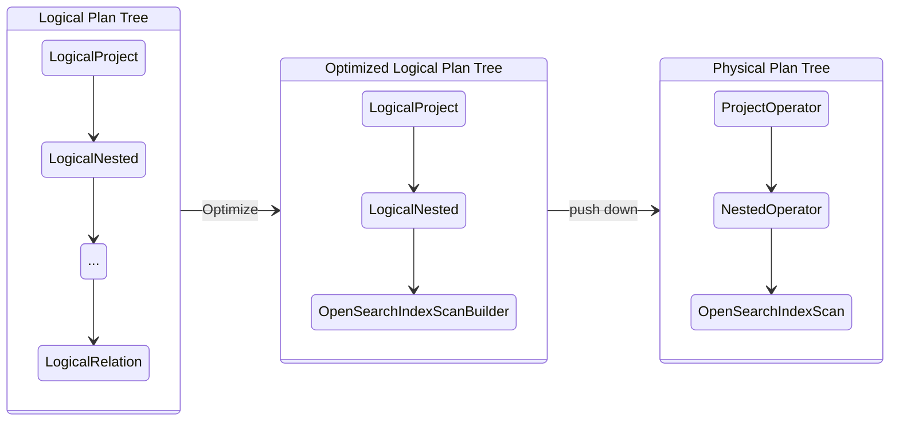
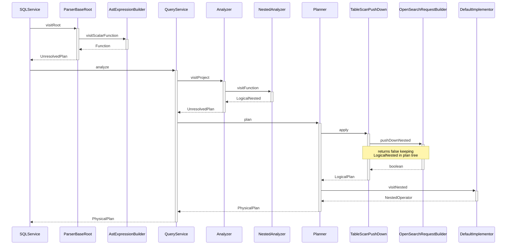
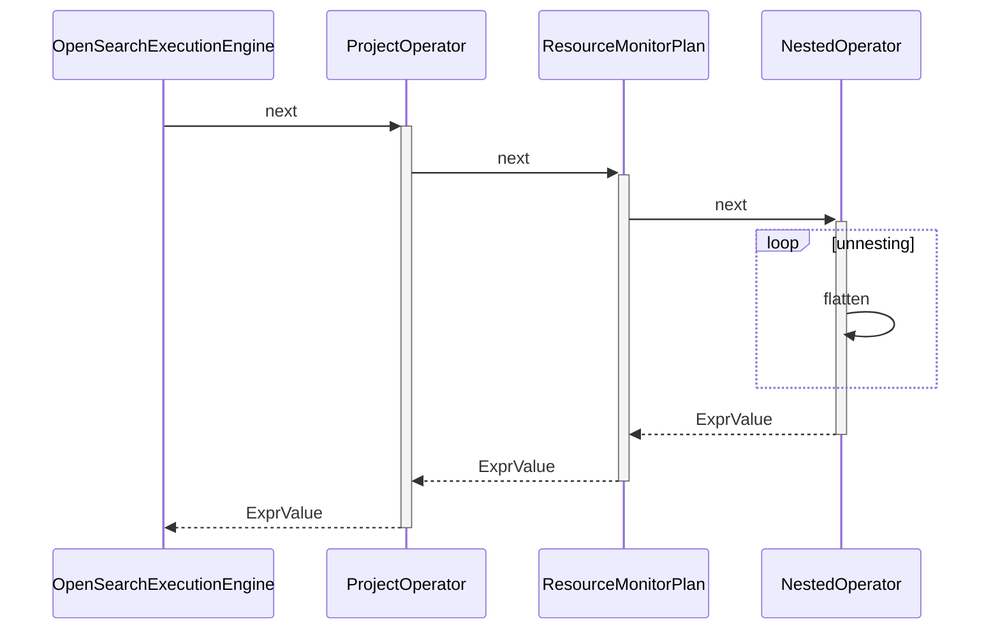
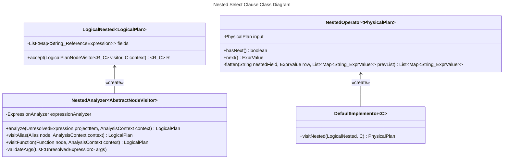

## Description

The `nested` function when used in the `SELECT` clause of an SQL statement specifies the output columns from inner fields of a nested object type in OpenSearch. After a `SELECT` clause is pushed down to OpenSearch the response objects are flattened as illustrated in [Section 2.3](#24-select-clause-nested-query-class-diagram). If multiple `nested` function calls are used in a `SELECT` clause on multiple nested fields with differing paths, a cross-join is returned of the rows in both nested fields.

## Table of Contents
1. [Overview](#1-overview)
2. [Syntax](#11-syntax)
3. [Changes To Core](#12-changes-to-core)
4. [Example Queries](#13-example-queries)
5. [Architecture Diagrams](#2-architecture-diagrams)
6. [Composite States for Nested Query](#21-composite-states-for-nested-query-execution)
7. [Sequence Diagram for Nested Select Clause Query Push Down](#22-sequence-diagram-for-nested-select-clause-query-push-down)
8. [Sequence Diagram for Nested Select Clause Post-processing](#23-sequence-diagram-for-nested-select-clause-post-processing)
9. [Select Clause Nested Query Class Diagram](#24-select-clause-nested-query-class-diagram)
10. [Additional Info](#additional-info)
11. [Demo Video](#demo-video)
12. [Release Schedule](#release-schedule)

## 1 Overview
### 1.1 Syntax

Dot notation is used to show nesting level for fields and paths. For example `nestedObj.innerFieldName` denotes a field nested one level. If the user does not provide the `path` parameter it will be generated dynamically. For example the `field` `user.office.cubicle` would dynamically generate the path `user.office`.
- `nested(field | field, path)`

### 1.2 Changes To Core
- **NestedOperator:** Responsible for post-processing and flattening of OpenSearch response.
- **LogicalNested:** Stores data required for OpenSearch DSL push down.
- **NestedAnalyzer:** Identifies nested functions used in `SELECT` clause for `LogicalNested` creation.
- **Analyzer:** Added ownership of NestedAnalyzer.


### 1.3 Example Queries

Most basic example from mapping to response from SQL plugin.

**Mapping:**
```json
{
  "mappings": {
    "properties": {
      "message": {
        "type": "nested",
        "properties": {
          "info": {
            "type": "keyword",
            "index": "true"
          }
        }
      }
    }
  }
}
```

**Dataset:**
```json
{"index":{"_id":"1"}}
{"message":{"info":"a"}}
```

**Query:**
`SELECT nested(message.info) FROM nested_objects;`

**Response:**
```json
{
    "schema": [
        {
            "name": "nested(message.info)",
            "type": "keyword"
        }
    ],
    "datarows": [
        [
            "a"
        ]
    ],
    "total": 1,
    "size": 1,
    "status": 200
}
```

A basic nested function in the SELECT clause and output DSL pushed to OpenSearch. This example queries the `nested` object `message` and the inner field `info` to return all matching inner fields values.
- `SELECT nested(message.info, message) FROM nested_objects;`
```json
{
    "query": {
        "bool": {
            "filter": [
                {
                    "bool": {
                        "must": [
                            {
                                "nested": {
                                    "query": {
                                        "match_all": {
                                            "boost": 1.0
                                        }
                                    },
                                    "path": "message",
                                    ...
                                    "boost": 1.0,
                                    "inner_hits": {
                                        ...
                                        "_source": {
                                            "includes": [
                                                "message.info"
                                            ],
                                            "excludes": []
                                        }
                                    }
                                }
                            }
                        ]
                    }
                }
            ]
        }
    },
    ...
}
```

Example with multiple SELECT clause function calls sharing same path. These two queries share the same path and will be added to the same inner hits query for pushing DSL to OpenSearch.
- `SELECT nested(message.info, message), nested(message.author, message) FROM nested_objects;`
```json
{
    "query": {
        "bool": {
            "filter": [
                {
                    "bool": {
                        "must": [
                            {
                                "nested": {
                                    "query": {
                                        "match_all": {
                                            "boost": 1.0
                                        }
                                    },
                                    "path": "message",
                                    ...
                                    "inner_hits": {
                                        ...
                                        "_source": {
                                            "includes": [
                                                "message.info",
                                                "message.author"
                                            ],
                                            "excludes": []
                                        }
                                    }
                                }
                            }
                        ],
                    }
                }
            ],
        }
    },
    ...
}
```

An example with multiple nested function calls in the SELECT clause having differing path values. This shows the separate nested query being created for each path used within the SQL query.
- `SELECT nested(message.info, message), nested(comment.data, comment) FROM nested_objects;`
```json
{
    "query": {
        "bool": {
            "filter": [
                {
                    "bool": {
                        "must": [
                            {
                                "nested": {
                                    "query": {
                                        "match_all": {
                                            "boost": 1.0
                                        }
                                    },
                                    "path": "comment",
                                    ...
                                    "inner_hits": {
                                        ...
                                        "_source": {
                                            "includes": [
                                                "comment.data"
                                            ],
                                            "excludes": []
                                        }
                                    }
                                }
                            },
                            {
                                "nested": {
                                    "query": {
                                        "match_all": {
                                            "boost": 1.0
                                        }
                                    },
                                    "path": "message",
                                    ...
                                    "inner_hits": {
                                        ...
                                        "_source": {
                                            "includes": [
                                                "message.info"
                                            ],
                                            "excludes": []
                                        }
                                    }
                                }
                            }
                        ],
                    }
                }
            ],
        }
    },
    ...
}
```

## 2 Architecture Diagrams
### 2.1 Composite States for Nested Query Execution

Nested function state diagram illustrating states in SQL plugin for push down execution. The nested operator stays in the `Physical Plan Tree` after push down for flattening operation in post-processing. See section [2.3](#24-select-clause-nested-query-class-diagram) for flattening sequence and description.



### 2.2 Sequence Diagram for Nested SELECT Clause Query Push Down
Nested function sequence diagram illustrating query execution from parsing to OpenSearch DSL push down.



### 2.3 Sequence Diagram for Nested SELECT Clause Post-processing
Nested function sequence diagram illustrating the flattening of the OpenSearch response. Flattening the response from OpenSearch changes the nested types structure by making the full path of an object the key, and the object it refers to the value. As well when a user selects multiple nested fields with differing path values, a cross join is done on the result. These examples show the flattening output keys and cross join.

**Sample input:**
```json
{
  "comments": {
    "data": "abc"
  },
  "message": [
    { "info": "letter1" },
    { "info": "letter2" }
  ]
}
```
**Sample Output:**
```json
[
  [
    { "comment.data": "abc" },
    { "message.info": "letter1" }
  ],
  [
    { "comment.data": "abc" },
    { "message.info": "letter2" }
  ]
]
```



### 2.4 Select Clause Nested Query Class Diagram
Nested function class diagram for additional classes required for query execution. The `NestedAnalyzer` is a visitor for nested functions used in the SELECT clause to fulfill the `LogicalNested` LogicalPlan. After push down is successful the `NestedOperator` PhysicalPlan is used for object flattening of the OpenSearch response.



## Additional Info

### Demo Video

[SELECT Clause Demo](https://user-images.githubusercontent.com/36905077/234634885-d28b3a9a-fc5f-41fb-938a-764b60a775a6.mp4)

### Release Schedule
See Issues Tracked under [Issue 1111](https://github.com/opensearch-project/sql/issues/1111) for related PR's and information.

