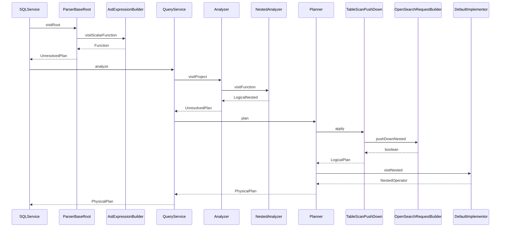
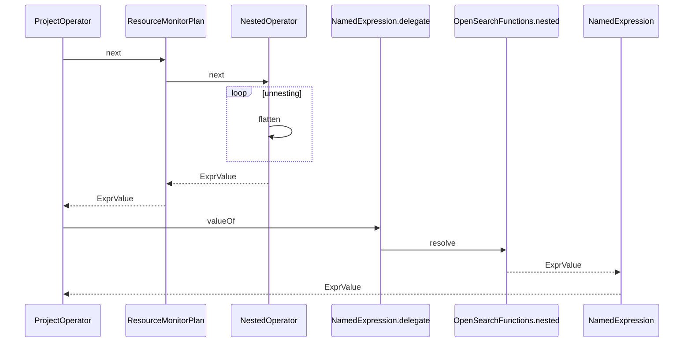
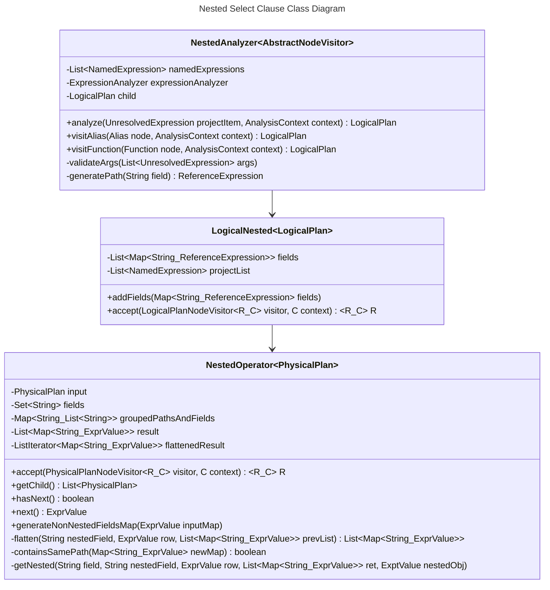

## 1 Overview

The `nested` function when used in the `SELECT` clause of an SQL statement specifies the output columns from inner fields of a nested object type in OpenSearch. After a `SELECT` clause is pushed down to OpenSearch the response objects are flattened as illustrated in [Section 2.3](#24-select-clause-nested-query-class-diagram). If multiple `nested` function calls are used in a `SELECT` clause on multiple nested fields with differing paths, a cross-join is returned of the rows in both nested fields.

### 1.1 Syntax

Dot notation is used to show nesting level for fields and paths. For example `nestedObj.innerFieldName` denotes a field nested one level.
- `nested(field | field, path)`

### 1.2 Changes To Core
- **NestedOperator:** Responsible for post-processing and flattening of OS response.
- **LogicalNested:** Stores data required for push down.
- **NestedAnalyzer:** Visitor for LogicalNested instantiation.
- **Analyzer:** Added ownership of NestedAnalyzer.

### 1.3 Example Queries
A basic nested function in the SELECT clause and output DSL pushed to OpenSearch.
- `SELECT nested(message.info, message) FROM nested_objects;`
```json
{
    "from": 0,
    "size": 200,
    "timeout": "1m",
    "query": {
        "bool": {
            "filter": [
                {
                    "bool": {
                        "must": [
                            {
                                "nested": {
                                    "query": {
                                        "match_all": {
                                            "boost": 1.0
                                        }
                                    },
                                    "path": "message",
                                    "ignore_unmapped": false,
                                    "score_mode": "none",
                                    "boost": 1.0,
                                    "inner_hits": {
                                        "ignore_unmapped": false,
                                        "from": 0,
                                        "size": 3,
                                        "version": false,
                                        "seq_no_primary_term": false,
                                        "explain": false,
                                        "track_scores": false,
                                        "_source": {
                                            "includes": [
                                                "message.info"
                                            ],
                                            "excludes": []
                                        }
                                    }
                                }
                            }
                        ],
                        "adjust_pure_negative": true,
                        "boost": 1.0
                    }
                }
            ],
            "adjust_pure_negative": true,
            "boost": 1.0
        }
    },
    "_source": {
        "includes": [
            "message.info"
        ],
        "excludes": []
    }
}
```

Example with multiple SELECT clause function calls sharing same path. Queries sharing same path will be added to the same inner hits query for OpenSearch DSL push down.
- `SELECT nested(message.info, message), nested(message.author, message) FROM nested_objects;`
```json
{
    "from": 0,
    "size": 200,
    "timeout": "1m",
    "query": {
        "bool": {
            "filter": [
                {
                    "bool": {
                        "must": [
                            {
                                "nested": {
                                    "query": {
                                        "match_all": {
                                            "boost": 1.0
                                        }
                                    },
                                    "path": "message",
                                    "ignore_unmapped": false,
                                    "score_mode": "none",
                                    "boost": 1.0,
                                    "inner_hits": {
                                        "ignore_unmapped": false,
                                        "from": 0,
                                        "size": 3,
                                        "version": false,
                                        "seq_no_primary_term": false,
                                        "explain": false,
                                        "track_scores": false,
                                        "_source": {
                                            "includes": [
                                                "message.info",
                                                "message.author"
                                            ],
                                            "excludes": []
                                        }
                                    }
                                }
                            }
                        ],
                        "adjust_pure_negative": true,
                        "boost": 1.0
                    }
                }
            ],
            "adjust_pure_negative": true,
            "boost": 1.0
        }
    },
    "_source": {
        "includes": [
            "message.info",
            "message.author",
            "message"
        ],
        "excludes": []
    }
}
```

An example with multiple nested function calls in SELECT clause using having differing path values. A separate nested query will be created for each path used within the SQL query.
- `SELECT nested(message.info, message), nested(comment.data, comment) FROM nested_objects;`
```json
{
    "from": 0,
    "size": 200,
    "timeout": "1m",
    "query": {
        "bool": {
            "filter": [
                {
                    "bool": {
                        "must": [
                            {
                                "nested": {
                                    "query": {
                                        "match_all": {
                                            "boost": 1.0
                                        }
                                    },
                                    "path": "comment",
                                    "ignore_unmapped": false,
                                    "score_mode": "none",
                                    "boost": 1.0,
                                    "inner_hits": {
                                        "ignore_unmapped": false,
                                        "from": 0,
                                        "size": 3,
                                        "version": false,
                                        "seq_no_primary_term": false,
                                        "explain": false,
                                        "track_scores": false,
                                        "_source": {
                                            "includes": [
                                                "comment.data"
                                            ],
                                            "excludes": []
                                        }
                                    }
                                }
                            },
                            {
                                "nested": {
                                    "query": {
                                        "match_all": {
                                            "boost": 1.0
                                        }
                                    },
                                    "path": "message",
                                    "ignore_unmapped": false,
                                    "score_mode": "none",
                                    "boost": 1.0,
                                    "inner_hits": {
                                        "ignore_unmapped": false,
                                        "from": 0,
                                        "size": 3,
                                        "version": false,
                                        "seq_no_primary_term": false,
                                        "explain": false,
                                        "track_scores": false,
                                        "_source": {
                                            "includes": [
                                                "message.info"
                                            ],
                                            "excludes": []
                                        }
                                    }
                                }
                            }
                        ],
                        "adjust_pure_negative": true,
                        "boost": 1.0
                    }
                }
            ],
            "adjust_pure_negative": true,
            "boost": 1.0
        }
    },
    "_source": {
        "includes": [
            "message.info",
            "comment",
            "comment.data",
            "message"
        ],
        "excludes": []
    }
}
```

## 2 Architecture Diagrams

### 2.1 Composite States for Nested Query Execution

Nested function state diagram illustrating states in SQL plugin for push down execution. The nested operator stays in the `PhysicalPlan` after push down for flattening operation in post-processing. See section [2.3](#24-select-clause-nested-query-class-diagram) for flattening sequence and description.

```mermaid
stateDiagram-v2
direction LR
    LogicalPlan --> OptimizedLogicalPlan: Optimize
    OptimizedLogicalPlan --> PhysicalPlan:push down
    note right of PhysicalPlan
    NestedOperator stays in PhysicalPlan\nafter push down for post-processing.
    end note

    state "Logical Plan" as LogicalPlan:::blah
    state LogicalPlan {
        logState1: Project
        logState2: Nested
        logState3: ...

        logState1 --> logState2
        logState2 --> logState3
        logState3 --> Relation
    }

    state "Optimized Logical Plan" as OptimizedLogicalPlan:::blah
    state OptimizedLogicalPlan {
        optState1: Project
        optState2: Nested
        optState3: ...

        optState1 --> optState2
        optState2 --> optState3
        optState3 --> IndexScanBuilder
    }

    state "Physical Plan" as PhysicalPlan
    state PhysicalPlan {
        phyState1: ProjectOperator
        phyState2: NestedOperator

        phyState1 --> phyState2
        phyState2 --> IndexScan
    }
```

### 2.2 Sequence Diagram for Nested SELECT Clause Query Push Down
Nested function sequence diagram illustrating query execution from parsing to OpenSearch DSL push down.



### 2.3 Sequence Diagram for Nested SELECT Clause Post-processing
Nested function sequence diagram illustrating the flattening of the OpenSearch response. Flattening the response from OpenSearch changes the nested types structure by making the full path of an object the key, and the object it refers to the value.

**Sample input:**
```json
{
  "comments": {
    "likes": 2
  }
}
```
**Sample Output:**
```json
{
  "comment.likes": 2
}
```



#### 2.4 Select Clause Nested Query Class Diagram
Nested function class diagram for additional classes required for query execution. The `NestedAnalyzer` is a visitor for nested functions used in the SELECT clause to fulfill the `LogicalNested` LogicalPlan. After push down is successful the `NestedOperator` PhysicalPlan is used for object flattening of the OpenSearch response.



## Additional Info

### Demo Video

[SELECT Clause Demo](https://user-images.githubusercontent.com/36905077/234634885-d28b3a9a-fc5f-41fb-938a-764b60a775a6.mp4)

### Release Schedule

- **Phase 1:** Add support for nested function used in SELECT clause.
  - **Released:** [Issue 1111](https://github.com/opensearch-project/sql/issues/1111)
- **Phase 2:** Add support for wildcard used in SELECT clause nested function.
  - **TBD**