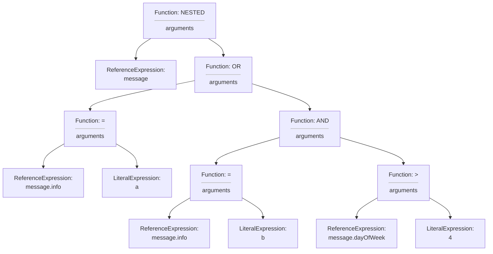
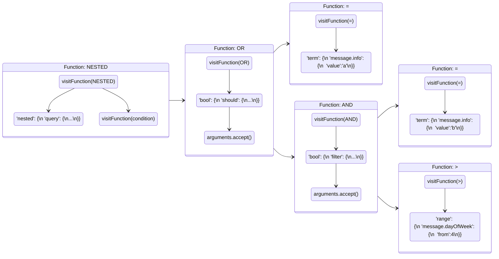
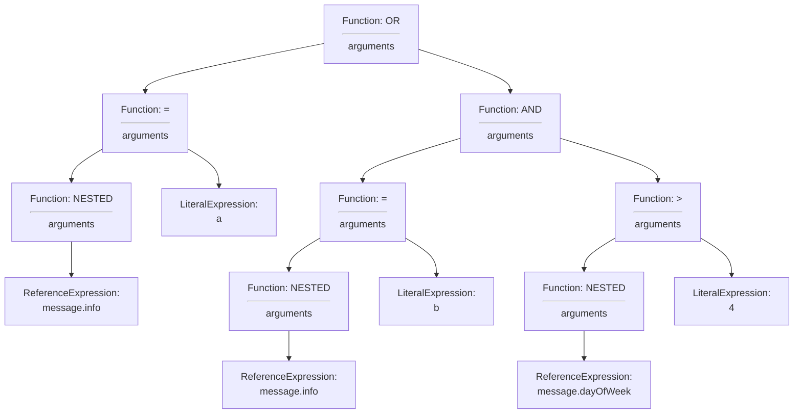
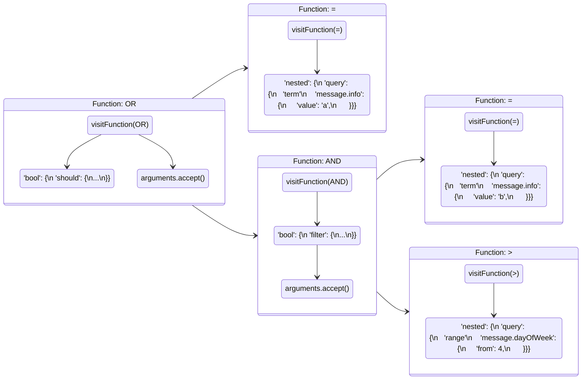

## Description

The `nested` function when used in the `WHERE` clause of an SQL statement filters documents of `nested` object type based on field properties. Two syntax options are available to users, see section [1.1 Syntax](#11-syntax). Both syntax options achieve the goal of filtering a `nested` field with an `Operator` and a `Literal` value. Although semantically the syntax options can produce the same query, they will produce different DSL to push to OpenSearch. This difference is based on the `AND/OR/NOT` boolean queries residing inside a `nested` query or vice versa. See section [2.1](#21-syntax-option-1-object-tree-to-dsl) and [2.2](#22-syntax-option-2-object-tree-to-dsl) for examples depicting this alternate DSL creation. Testing large groups of push down execution times for identical queries using the different syntax options showed a nominal difference of approximately 3% for Syntax option 2.

## Table of Contents
1. [Overview](#1-overview)
2. [Syntax](#11-syntax)
3. [Changes To Core](#12-changes-to-core)
4. [Example Data And Usage](#13-example-data-and-usage)
5. [Example Queries](#14-example-queries)
6. [Architecture Diagrams](#2-architecture-diagrams)
8. [Syntax Option 1 Object Tree to DSL](#21-syntax-option-1-object-tree-to-dsl)
9. [Syntax Option 2 Object Tree to DSL](#22-syntax-option-2-object-tree-to-dsl)
10. [Additional Info](#additional-info)
11. [Release Schedule](#release-schedule)

## 1 Overview
### 1.1 Syntax

The nested function has two syntax options when used in the `WHERE` clause of an SQL statement. Both syntax options can produce the same OpenSearch response, but will form different DSL used in the query.
1. `nested(path, condition)`
2. `nested(field | field, path) OPERATOR LITERAL`


### 1.2 Changes To Core
- **FilterQueryBuilder:** Added logic to handle `nested` functions in `WHERE` clause as predicate expression and `FunctionExpression`.
- **LuceneQuery:** Added logic to handle `nested` functions and `FunctionExpression`'s on both sides of `OPERATOR` in `WHERE` clause.


### 1.3 Example Data and Usage

A basic example from data mapping to response from SQL plugin.

**Mapping:**
```json
{
  "mappings": {
    "properties": {
      "message": {
        "type": "nested",
        "properties": {
          "info": {
            "type": "keyword",
            "index": "true"
          }
        }
      }
    }
  }
}
```

**Dataset:**
```json
{"index":{"_id":"1"}}
{"message":{"info":"a"}}
{"index":{"_id":"2"}}
{"message":{"info":"c"}}
```

**Query:**
- `SELECT * FROM nested_objects WHERE nested(message, message.info = 'a');`
- `SELECT * FROM nested_objects WHERE nested(message.info) = 'a';`

Both queries produce same response from OpenSearch.

**Response:**
```json
{
  "schema": [
    {
      "name": "message",
      "type": "nested"
    }
  ],
  "datarows": [
    [
      [
        {
          "info": "a"
        }
      ]
    ]
  ],
  "total": 1,
  "size": 1,
  "status": 200
}
```


### 1.4 Example Queries

A basic nested function in the `SELECT` clause. This example filters the `nested` object `message` and the inner field `info` with the value of `a`.
- `SELECT * FROM nested_objects WHERE nested(message.info) = 'a' OR nested(message.author) = 'elm';`

Using the same query as above but with syntax option 1, the response from OpenSearch will be the same, but the DSL used in the query will differ.
- `SELECT * FROM nested_objects WHERE nested(message, message.info = 'a' OR messate.author = 'elm');`

This example has a nested function in the `SELECT` clause and the `WHERE` clause of the query. Using the `nested` function in the `SELECT` clause will flatten the response nested objects from OpenSearch. See [Nested In Select](sql-nested-function-select-clause.md) for more details on flattening.
- `SELECT nested(message.info) FROM nested_objects WHERE nested(message.info) = 'a';`

When using syntax option 1 we need separate function calls when the `path` is not identical. This query exemplifies how a user can use multiple queries with differing `path` values. 
- `SELECT * FROM nested_objects WHERE nested(message, message.info = 'a') OR nested(comment, comment.data = '123');`


## 2 Architecture Diagrams
### 2.1 Syntax Option 1 Object Tree to DSL
The following example illustrates the object tree that is built from the example query. This query's object tree will impact the structure of the DSL to be pushed to OpenSearch.

Example Query: `SELECT *  FROM nested_objects WHERE nested(message, message.info = 'a' OR message.info = 'b' AND message.dayOfWeek > 4);`




#### Syntax Option 1 Filter Push Down Sequence
This diagram illustrates the steps the SQL plugin does to translate the object tree to DSL for execution in OpenSearch. Notice that the `nested` function forms the outer portion of the DSL query.




#### Syntax Option 1 Output Query
After pushing down the filter object tree we have a DSL query to push to OpenSearch. This query forms the boolean logic inside the `nested` query. This mirrors the syntax option chosen which has the condition specified inside the `nested` function.

```json
{
  "nested" : {
    "query" : {
      "bool" : {
        "should" : [
          {
            "term" : {
              "message.info" : {
                "value" : "a",
                "boost" : 1.0
              }
            }
          },
          {
            "bool" : {
              "filter" : [
                {
                  "term" : {
                    "message.info" : {
                      "value" : "b",
                      "boost" : 1.0
                    }
                  }
                },
                {
                  "range" : {
                    "message.dayOfWeek" : {
                      "from" : 4,
                      ...
                    }
                  }
                }
              ]
            }
          }
        ]
      }
    }
  }
}
```


### 2.2 Syntax option 2 Object Tree to DSL
The following example illustrates the object tree that is built from the example query. Rather than have the boolean logic specified within the `nested` function, we have the `nested` function used in a predicate expression.

Example Query: `SELECT * FROM nested_objects WHERE nested(message.info) = 'a' OR nested(message.info) = 'b' AND nested(message.dayOfWeek) > 4;`




#### Syntax Option 2 Filter Push Down Sequence
This diagram illustrates the steps the SQL plugin goes through to translate the object tree to DSL for execution in OpenSearch. Notice that the boolean operations(`should/filter`) form the outer potion of the DSL query. 




#### Syntax Option 2 Output Query
After pushing down the filter object tree we have a DSL query to push to OpenSearch. This query forms the boolean logic as the outer portion of the query and has nested queries used inside. This mirrors the syntax option chosen which has the boolean operators forming a predicate expression with the `nested` functions in the SQL query.

```json
{
  "bool" : {
    "should" : [
      {
        "nested" : {
          "query" : {
            "term" : {
              "message.info" : {
                "value" : "a",
                "boost" : 1.0
              }
            }
          },
          ...
        }
      },
      {
        "bool" : {
          "filter" : [
            {
              "nested" : {
                "query" : {
                  "term" : {
                    "message.info" : {
                      "value" : "b",
                      "boost" : 1.0
                    }
                  }
                },
                ...
              }
            },
            {
              "nested" : {
                "query" : {
                  "range" : {
                    "message.dayOfWeek" : {
                      "from" : 4,
                      ...
                    }
                  }
                },
                ...
              }
            }
          ]
        }
      }
    ]
  }
}
```


## Additional Info
### Demo Video
TBD

### Normalizing Strategy
A normalization strategy could produce identical DSL independent on the syntax option used in the query. Testing so far hasn't highlighted any major improvements with query execution that necessitate identical DSL. Additional benchmarking and planning will be done to determine a viable normalization strategy and if implementation is required.

### Release Schedule
See Issues Tracked under [Issue 1111](https://github.com/opensearch-project/sql/issues/1111) for related PR's and information.
