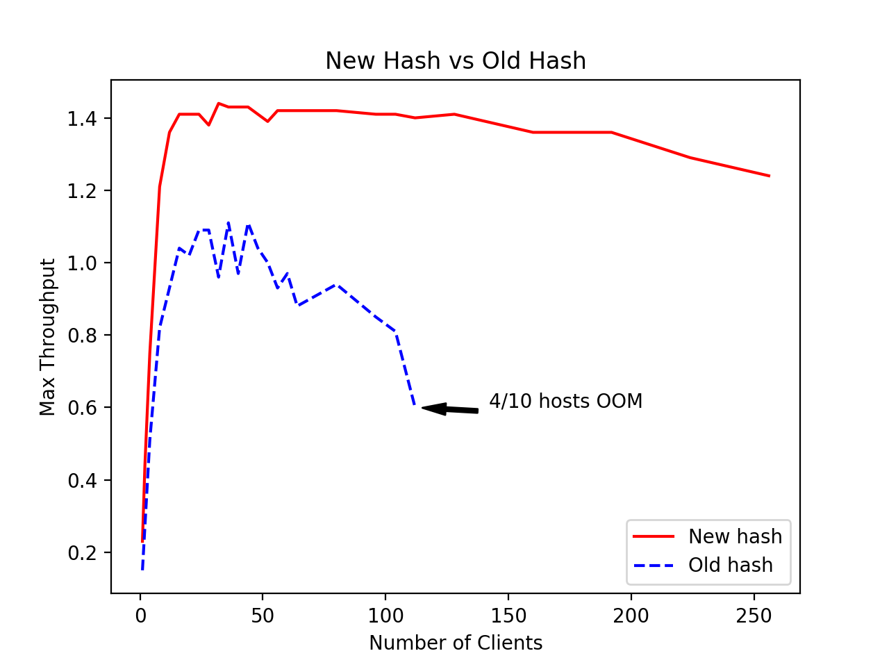

# OpenSearch SQL Hash Join Benchmark

## Summary

New hash algorithm introduced memory circuit breaker logic to improve cluster's stability which includes:

1) Rejecting new requests
2) Terminating ongoing requests with half chance
3) Retrying remaining requests with binary exponential backoff when memory circuit breaker being triggered

The result summary is as following:

* For cluster stability: the cluster turned from green to yellow due to 4 nodes OOM when using 112 clients sending requests against old hash algorithm. For new hash algorithm, no OOM happened when increasing client's number from 1 to 256.
* For error rate (Graph 1): there are 3 phases as below
    1) Before memory circuit breaker being triggered, the error rate of new and old hash is almost same
    2) Between memory circuit breaker being triggered and OOM, old hash is slightly better than new hash, as new hash starting rejecting new request and terminating some ongoing requests
    3) After OOM, new hash is much better than old hash
* For throughput: new hash is roughly 1.4x larger than old hash at peak ( Graph 2 and Graph 3). The new hash throughput is able to stay flat with small drop with increased traffic after peak, while old hash drops to almost 0 dramatically
* For latency: new hash is roughly 2x faster than old hash ( Graph 4 and Graph 5). The new hash latency increase gradually with increased traffic, while old hash increases quickly to timeout

## New Hash Join vs Old Hash Join

### Comparison Chart

Graph 1. SQL Request Error Rates

Graph 2. SQL Request Midian Throughput

Graph 3. SQL Request Max Throughput

Graph 4. SQL Request Latency(90th)

Graph 5. SQL Request Latency(100th)

### Metrics Table

|new/old	|error rate	|Min Throughput	|Median Throughput	|Max Throughput	|50th percentile service time(ms)	|90th percentile service time(ms)	|100th percentile service time(ms)	|
|---	|---	|---	|---	|---	|---	|---	|---	|
|client 1	|0/0	|0.22/0.14	|0.23/0.14	|0.23/0.15	|4398.03/6793.26	|4519.72/7157.93	|4556.68/7319.67	|
|2	|0/0	|0.21/0.14	|0.42/0.27	|0.44/0.27	|4529.56/7268.88	|4859.31/7642.02	|5043.91/7747.27	|
|4	|0/0	|0.17/0.14	|0.72/0.5	|0.75/0.51	|5166.9/7748.35	|6271.85/8514.29	|6508.67/8883.52	|
|8	|0/0	|0.14/0.13	|1.1/0.78	|1.21/0.82	|6265.32/9267.44	|7893.14/11703	|9955.2/16547.8	|
|12	|0/0	|0.16/0.09	|1.27/0.86	|1.36/0.93	|8385.8/11542.2	|11310.6/19027	|15701.7/29448.6	|
|16	|0/0	|0.11/0.09	|1.34/0.93	|1.41/1.04	|10964/13579.7	|13591.7/23738.8	|29999.9/57866.3	|
|20	|0/0	|0.15/0.11	|1.35/0.95	|1.41/1.02	|13654.8/15460.2	|16589.2/30604.2	|37880.5/71374.4	|
|24	|0/0	|0.15/0.08	|1.34/1.02	|1.41/1.09	|16609.7/17939.8	|18661.8/34166.7	|34176.2/84520.8	|
|28	|0/0	|0.15/0.07	|1.32/1.04	|1.38/1.09	|19872.9/22568.2	|21834.8/40839.4	|34354.7/96654.6	|
|32	|0/0.16	|0.14/0.07	|1.37/0.91	|1.44/0.96	|21617.1/27872.8	|24492.8/61663.8	|45525.2/137660	|
|36	|0/0	|0.13/0.06	|1.36/1.01	|1.43/1.11	|24298.6/28685	|28287.7/60041.9	|53979.8/179186	|
|40	|0/0.12	|0.13/0.05	|1.36/0.9	|1.43/0.97	|26757.6/37112.8	|32095.2/75590	|53645.1/187090	|
|44	|0/0.23	|0.11/0.06	|1.35/0.89	|1.43/1.11	|29839/34705.2	|34624.5/100260	|68112.8/293268	|
|48	|0.1/0.1	|0.13/0.05	|1.34/0.94	|1.41/1.04	|33045.6/41554.3	|39435/104887	|67977.1/300102	|
|52	|0/0.19	|0.06/0.05	|1.34/0.88	|1.39/1	|35791.6/51592.9	|43932.3/109775	|76325.6/257596	|
|56	|0.09/0.36	|0.09/0.04	|1.34/0.85	|1.42/0.93	|38293.1/55292.1	|45416.2/114583	|82477/302718	|
|60	|0/0.42	|0.06/0.04	|1.34/0.85	|1.42/0.97	|39968.6/52092.1	|52305.4/125024	|102205/301147	|
|64	|0.16/0.31	|0.07/0.04	|1.36/0.79	|1.42/0.88	|43305.7/69363.5	|53506.4/137777	|102473/300098	|
|80	|3.25/1.88	|0.1/0.03	|1.34/0.8	|1.42/0.94	|53010.9/76741.6	|68640.2/189654	|116249/302413	|
|96	|10.52/6.41	|0.05/0.02	|1.34/0.71	|1.41/0.85	|58077/100977	|81759.3/261025	|154210/311654	|
|104	|16.97/25	|0.05/0.02	|1.34/0.68	|1.41/0.81	|56783.5/134293	|87941.9/300097	|164701/301858	|
|112	|22.05/54.42	|0.05/0.02	|1.33/0.45	|1.4/0.6	|55878.9/300011	|90370.2/300101	|153104/600105	|
|128	|24.18/	|0.04/	|1.36/	|1.41/	|60332.6/	|100740/	|185666/	|
|160	|30.69/	|0.06/	|1.32/	|1.36/	|70775.7/	|119802/	|226247/	|
|192	|33.31/	|0.06/	|1.32/	|1.36/	|82855.3/	|138061/	|300099/	|
|224	|37.19/	|0.05/	|1.25/	|1.29/	|94475.5/	|164847/	|280743/	|
|256	|40.35/	|0.04/	|1.2/	|1.24/	|110558/	|186512/	|284701/	|

Beyond and equal 112 clients, OOM happened for old hash. In 112 clients test case, there were 4 hosts of OOM and the cluster turned to yellow.
No OOM happened in new hash test cases.
