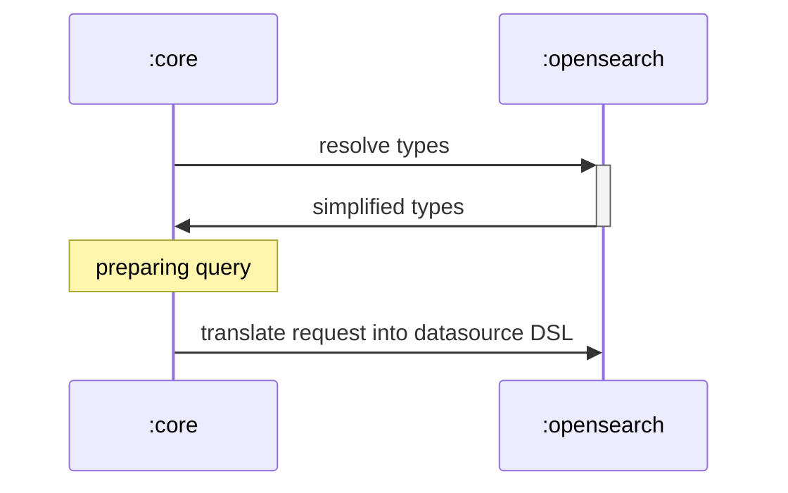

## History overview

* [odfe#620](https://github.com/opendistro-for-elasticsearch/sql/pull/620) - added two types for `text` (just text and text with fields), querying and string functions are supported, but searching is not.
* [odfe#682](https://github.com/opendistro-for-elasticsearch/sql/pull/682) and [odfe#730](https://github.com/opendistro-for-elasticsearch/sql/pull/730) - added support for querying (in 682) and aggregation (730); if `text` has sub-fields, `.keyword` prefix is added to the field name regardless of the sub-field names.
* [#1314](https://github.com/opensearch-project/sql/pull/1314) and [#1664](https://github.com/opensearch-project/sql/pull/1664) - changed format of storing `text` type; it is one type now, subfield information is stored, but not yet used.
* Current changes (no PR number yet) - correctly resolve sub-field name if a `text` field has only one subfield. Fixes [#1112](https://github.com/opensearch-project/sql/issues/1112) and [#1038](https://github.com/opensearch-project/sql/issues/1038).

## Further changes

* Support search for text sub-fields ([#1113](https://github.com/opensearch-project/sql/issues/1113)).
* Support multiple sub-fields for text ([#1887](https://github.com/opensearch-project/sql/issues/1887)).
* Support non-default date formats for search queries ([#1847](https://github.com/opensearch-project/sql/issues/1847)). Fix for this bug depends on the current changes.

## Problem statement

`:opensearch` module parses index mapping and builds instances of `OpenSearchDataType` (a base class), but ships simplified types (`ExprCoreType` - a enum) to `:core` module, because `:core` uses `ExprCoreType`s to resolve functions.

Later, `:core` returns to `:opensearch` the DSL request with types stored. Since types were simplified, all mapping information is lost. Adding new `TEXT` entry to `ExprCoreType` enum is not enough, because `ExprCoreType` is datasource agnostic and can't store any specific mapping info.

## Solution

The solution is to provide to `:core` non simplified types, but full types. Those objects should be fully compatible with `ExprCoreType` and implement all required APIs to allow `:core` to manipulate with built-in functions. Once those type objects are returned back to `:opensearch`, it can get all required information to build the correct search request.

1. Pass full (non simplified) types to and through `:core`.
2. Update `OpenSearchDataType` (and inheritors if needed) to be comparable with `ExprCoreType`.
3. Update `:core` to do proper comparison (use `.equals` instead of `==`).
5. Update `:opensearch` to use the mapping information received from `:core` and properly build the search query.

## Type Schema

| JDBC type | `ExprCoreType` | `OpenSearchDataType` | OpenSearch type |
| --- | --- | --- | --- |
| `VARCHAR`/`CHAR` | `STRING` | -- | `keyword` |
| `LONGVARCHAR`/`TEXT` | `STRING` | `OpenSearchTextType` | `text` |
